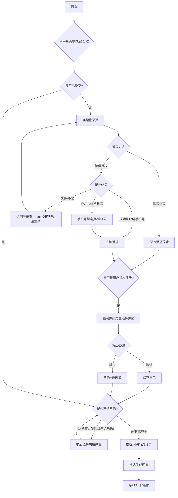
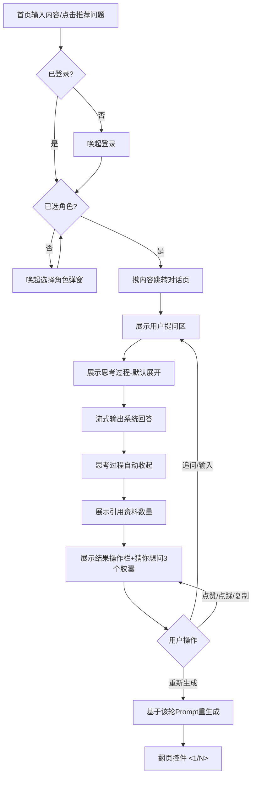
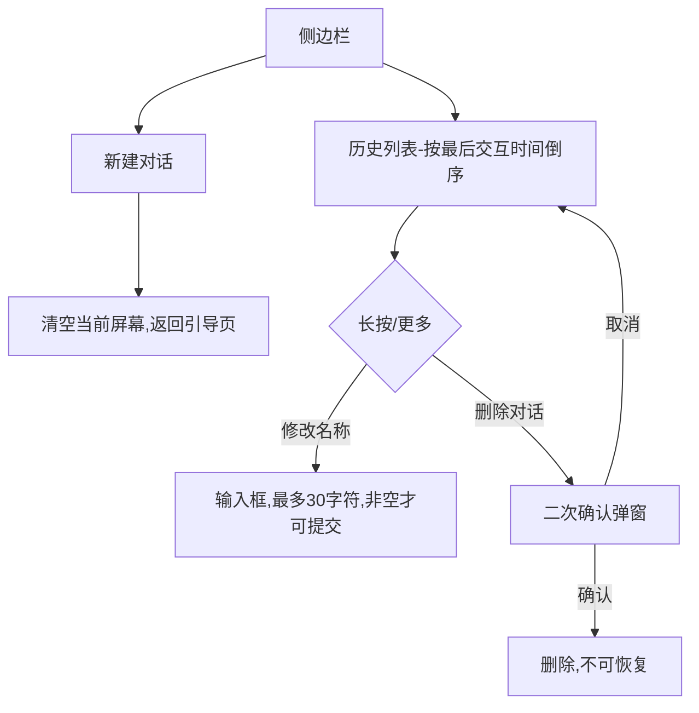

# 智能助手 PRD 文档

> 产品：博美智研 · 美妆智能助理
> 文档类型：功能需求文档（Phase 分层 PRD）

---

## 【版本说明】

| 版本号 | 日期 | 作者 | 状态 | 说明（初始版本 / 修订说明） | 文档链接 |
| :--- | :--- | :--- | :--- | :--- | :--- |
| V-0.9.0 | 2026-06-09 | XXX | 草稿 | 初始草稿：新增智能助手板块，含登录、首页、角色选择、对话工作区、历史记录、设置、后台字段、异常边界 | 待补充 |
| V-1.0.0 | 2026-06-11 | XXX（产品） | 待评审 | 结构化完善：补齐产品定位、用户场景、Mermaid 流程、交互规范、业务规则、边界条件、非功能需求、需求缺口、验收标准 AC、后续 Phase 规划，统一术语与状态机 | 待补充 |

> **状态流转说明**：草稿 → 待评审 → 已定稿 → 完成 → 更新
> **当前状态**：待评审（待研发、设计、测试三方评审后定稿）

---

## 一、产品定位与背景

### 1.1 背景

随着美妆行业在配方研发、成分合规、法规审核等环节的专业化程度不断提升，从业者日常需要频繁检索成分数据、比对全球法规、分析配方风险。现有工具普遍存在以下痛点：

- **信息分散**：成分库、法规库、文献资料分属不同系统，需多次跳转检索；
- **门槛高**：通用搜索引擎无法理解专业语境，输出结果缺乏专业深度与可信引用；
- **缺乏角色适配**：产品经理、研发工程师、法务、领域专家的关注点不同，但现有工具输出"千人一面"。

为此，在「博美智研」平台中新增 **智能助手** 板块，依托精准 AI 算法与百万级成分数据库，为美妆行业从业者提供可对话、可引用、可定制的专业问答能力。

### 1.2 核心价值

- **专业可信**：基于百万级成分数据库 + 法规库，答案附带资料引用（`[1][2]` 脚注），可溯源。
- **角色定制**：依据用户"核心角色"动态推荐问题、调整默认话术，输出贴合岗位诉求。
- **体验灵活**：支持"快速 / 专家"模式与"亲和 / 专业"语调自由组合，兼顾即时性与深度。
- **流程闭环**：从首页提问 → 角色定制 → 多轮对话 → 历史沉淀，形成完整工作流。

### 1.3 量化目标（北极星与辅助指标）

| 指标类别 | 指标名称 | 目标值（上线后首个完整月） | 说明 |
| :--- | :--- | :--- | :--- |
| 北极星 | 智能助手周活跃用户数 WAU | ≥ 平台 WAU 的 30% | 衡量功能渗透 |
| 激活 | 新用户首日完成"角色选择"比例 | ≥ 60% | 衡量引导有效性 |
| 参与 | 人均日提问轮次 | ≥ 3 轮 | 衡量使用深度 |
| 留存 | 智能助手次周留存率 | ≥ 25% | 衡量持续价值 |
| 质量 | 答案点赞率（点赞 /（点赞+点踩）） | ≥ 80% | 衡量回答满意度 |
| 质量 | 重新生成触发率 | ≤ 15% | 间接衡量首答质量 |
| 性能 | 首 Token 响应时延（P95） | ≤ 3s | 衡量流式体验 |

> 注：以上目标值为建议基线，需与业务方在评审时校准（见第九章待决策项）。

### 1.4 阶段规划（概览）

- **Phase 1（本期 V-1.0.0）**：核心问答闭环。登录（含微信授权）、首页推荐、角色选择、对话工作区（双模式/双语调、思考过程、引用、反馈、重新生成、追问）、历史记录、设置、后台核心角色字段、异常边界。
- **Phase 2**：多模态输入（图片/文件解析）、对话内容导出、收藏与知识库沉淀。
- **Phase 3**：团队协作（会话共享）、Prompt 模板市场、用量分析看板。

> 详见第十一章。

---

## 二、用户与场景（新引导型）

### 2.1 目标用户画像

| 角色 | 典型诉求 | 关注点 | 高频问题示例 |
| :--- | :--- | :--- | :--- |
| 美妆产品经理 | 产品规划、配方成分及生命周期管理 | 成分趋势、卖点、合规可行性 | "美白精华常用的有效成分有哪些？" |
| 配方研发工程师 | 研发创新、复杂工艺配方管理 | 配方稳定性、成分相容性、工艺参数 | "烟酰胺与维C同配方的稳定性风险？" |
| 法律合规人员 | 审核安全标准、确保符合全球法规 | 各国法规限值、禁用/限用清单 | "某成分在欧盟化妆品法规下的限值？" |
| 细分领域专家（毒理/生物/化学合成等） | 提供深度专业支持 | 毒理数据、机理、合成路线 | "该成分的急性毒理学数据来源？" |

### 2.2 核心使用场景

- **场景 A：新用户首次使用（引导）**
  未登录用户在首页点击热门话题/输入框 → 唤起登录（账号密码 / 微信授权）→ 注册成功后强制弹出角色选择 → 选择角色后携带原提问进入对话页生成回答。
- **场景 B：老用户日常提问**
  已登录且已选角色用户 → 首页输入或点击推荐问题 → 直接进入对话页生成回答 → 多轮追问、切换模式/语调、对答案点赞/点踩/复制/重新生成。
- **场景 C：历史会话管理**
  用户从侧边栏查看历史会话 → 重命名 / 删除 / 新建对话。
- **场景 D：偏好调整**
  用户进入"设置-核心角色"修改角色 → 影响后续新建对话推荐与默认话术。
- **场景 E：异常兜底**
  触发敏感词 / 网络超时 / 高频提问时，系统给出统一兜底文案与恢复路径。

### 2.3 数据模型（关键实体）

> 智能助手既具引导属性又具功能属性，补充关键数据实体以约束后端字段与状态机。

**用户 User（扩展字段）**

| 字段 | 类型 | 必填 | 说明 |
| :--- | :--- | :--- | :--- |
| user_id | string | 是 | 用户唯一标识 |
| phone | string | 否 | 手机号（微信授权新用户需补绑） |
| wechat_openid | string | 否 | 微信 openid（微信授权登录） |
| core_role | enum | 否 | 核心角色：`pm` / `formulator` / `legal` / `expert`；未选择为 `null` |
| role_prompt_shown | bool | 是 | 是否已展示过角色选择弹窗（仅强制弹出一次） |

**会话 Conversation**

| 字段 | 类型 | 必填 | 说明 |
| :--- | :--- | :--- | :--- |
| conversation_id | string | 是 | 会话 ID |
| user_id | string | 是 | 所属用户 |
| title | string | 是 | 标题，默认取首问首句前 10 字符，超出加 `...` |
| created_at | datetime | 是 | 创建时间 |
| last_interact_at | datetime | 是 | 最后交互时间（列表倒序排序依据） |
| is_deleted | bool | 是 | 逻辑删除标识 |

**消息 Message / 回答版本 AnswerVersion**

| 字段 | 类型 | 必填 | 说明 |
| :--- | :--- | :--- | :--- |
| message_id | string | 是 | 消息 ID |
| conversation_id | string | 是 | 所属会话 |
| role | enum | 是 | `user` / `assistant` |
| content | text | 是 | 文本内容 |
| mode | enum | 否 | 生成时模式：`fast` / `expert`（assistant 消息） |
| tone | enum | 否 | 生成时语调：`friendly` / `professional` |
| reasoning | text | 否 | 思考过程（Reasoning 链路） |
| references | array | 否 | 引用资料列表（序号、标题、来源链接） |
| version_index | int | 否 | 重新生成版本序号，最新排第一，最多 6 个版本（原始 + 5 次重生） |
| feedback | enum | 否 | `like` / `dislike` / `null`（互斥） |

---

## 三、功能范围

### 3.1 本期包含（Phase 1）

| # | 模块 | 功能点 |
| :--- | :--- | :--- |
| 1 | 登录模块 | 功能入口触发登录、账号密码登录（原逻辑）、微信授权登录（新增）、手机号绑定、退出登录 |
| 2 | 首页模块 | 主标题、智能输入框、热门话题推荐区、角色定向推荐 + 兜底、交互流转 |
| 3 | 角色选择模块 | 首次注册强制弹出（一次）、4 种角色单选、确认 / 跳过 |
| 4 | 对话工作区 | 空状态引导页、对话状态、思考过程、双模式双语调及排版联动、流式输出、引用、结果操作栏（赞/踩/复制/重新生成）、翻页、猜你想问、底部输入区、中断、回到最新 |
| 5 | 历史记录管理 | 新建对话、历史列表、自动命名、重命名、删除（二次确认） |
| 6 | 设置与偏好 | 核心角色配置项、即时生效 |
| 7 | 博美智研后台 | 会员管理新增"核心角色"字段（列表/新增/编辑页） |
| 8 | 异常与边界 | 安全合规兜底、网络超时兜底、并发频率限制 |

### 3.2 本期不包含

| # | 不包含项 | 说明 / 归属阶段 |
| :--- | :--- | :--- |
| 1 | 多模态输入（上传图片、文档、附件解析） | Phase 2 |
| 2 | 对话内容导出（PDF / Word / Markdown） | Phase 2 |
| 3 | 答案收藏 / 个人知识库 | Phase 2 |
| 4 | 会话分享 / 团队协作 | Phase 3 |
| 5 | Prompt 模板市场 | Phase 3 |
| 6 | 语音输入 / TTS 朗读 | 暂不规划 |
| 7 | 多语言界面（i18n） | 暂不规划 |
| 8 | 历史会话搜索 | 待决策（见第九章） |

---

## 四、用户流程

### 4.1 整体主流程（Mermaid）

### 4.2 登录流程（场景 A/B）

1. 未登录用户在首页点击任意热门话题或点击/聚焦输入框区域 → 触发跳转至登录页。
2. 选择登录方式：
   - **账号密码登录**：沿用平台原有逻辑与校验。
   - **微信授权登录（新增）**：点击"微信登录"→ 唤起微信内置授权。
     - 授权成功 + 已绑定手机号 → 直接登录，回到触发前的动作（携带原提问）。
     - 授权成功 + 未绑定手机号（新用户）→ 跳转手机号绑定页，输入手机号、获取验证码、校验通过后完成注册/登录。
     - 授权失败 / 用户取消 → 返回登录页，Toast 提示"授权失败，请重试"。
3. 退出登录路径：首页 → 更多 → 设置 → 退出登录；退出后清空本地 Token，返回首页非登录态。

### 4.3 提问与对话流程（场景 B）

### 4.4 历史记录管理流程（场景 C）

---

## 五、界面与交互规范

> 以下按模块逐一展开。所有 Toast 默认展示约 2s 后自动消失；所有弹窗支持点击遮罩或关闭按钮取消（破坏性操作除外，需明确点击按钮）。

### 5.1 登录模块

| 元素 | 规范 |
| :--- | :--- |
| 触发入口 | 首页热门话题卡片、输入框区域（未登录态点击/聚焦即触发） |
| 登录方式 | 账号密码（原样式）、微信授权按钮（新增，置于登录方式区） |
| 微信授权 | 调起微信内置授权页；授权中按钮 loading；结果按 4.2 分支处理 |
| 手机号绑定页 | 字段：手机号（11 位校验）、验证码（60s 倒计时重发）；提交按钮在两项有效时高亮 |
| 异常提示 | 授权失败/取消 → Toast"授权失败，请重试" |
| 退出登录 | 设置页底部，点击二次确认（建议）后清 Token，回到首页非登录态 |

### 5.2 首页模块

| 元素 | 规范 |
| :--- | :--- |
| 主标题 | 平台/智能助手主标题 |
| 智能输入框 | 占位提示文案（如"输入你的问题…"）；点击输入框：已登录已选角色→跳转对话页；未登录→唤起登录；已登录未选角色→唤起角色弹窗 |
| 热门话题推荐区 | 卡片式展示推荐问题；点击卡片等同于"发送该问题" |
| 推荐机制 | 依据用户 `core_role` 定向推荐 |
| 兜底策略 | 用户未设角色或推荐接口异常 → 默认展示 3 个全局通用美妆百科类问题 |
| 交互流转 | 见 4.3；状态齐全则携带提问内容跳转对话页并立即开始生成 |

### 5.3 角色选择模块

| 元素 | 规范 |
| :--- | :--- |
| 触发 | 用户首次注册成功后强制弹出，仅展示一次（由 `role_prompt_shown` 控制） |
| 主标题 | 请选择你当前的核心角色 |
| 副标题 | 选择对应的职业角色以获取定制化体验 |
| 角色枚举（单选） | 美妆产品经理 / 配方研发工程师 / 法律合规人员 / 细分领域专家，各含一句职责说明 |
| 确认并进入 | 保存角色，跳转首页或接续之前的提问动作 |
| 跳过 | 角色状态记为"未选择"，提示"你稍后可以在偏好设置中随时更改角色" |

角色枚举说明文案：
- 【美妆产品经理】：负责产品规划、配方成分及生命周期管理
- 【配方研发工程师】：专注于研发创新，管理复杂的工艺配方
- 【法律合规人员】：审核安全标准，确保产品符合全球法规
- 【细分领域专家】：(毒理/生物/化学合成等) 提供深度专业支持

### 5.4 对话工作区

#### 5.4.1 空状态（引导页）

| 元素 | 规范 |
| :--- | :--- |
| 欢迎卡片标题 | 「Hi！我是你的美妆智能助理」 |
| 欢迎卡片文本 | 「基于精准 AI 算法与百万级成分数据库，为你提供专业的配方分析与法规指导。」 |
| 推荐问题 | 依据角色动态展示 3 个问题（无角色/异常时走兜底 3 个通用问题） |
| 全局参数配置 | 置于输入框上方或侧边：模式（快速 默认 / 专家）、语调（亲和 默认 / 专业） |
| 模式说明 | 快速模式：快速回答，即时响应；专家模式：专业回答，深度研究 |

#### 5.4.2 对话状态

| 区域 | 规范 |
| :--- | :--- |
| 用户提问区 | 展示用户输入文本 |
| 模型思考过程 | 在答案输出前/上方展示折叠的"思考过程"（调取 Reasoning 链路）；**默认展开**，可点击展开/折叠；**思考完成后自动收起** |
| 系统回答区-排版联动 | 快速模式 + 亲和语调 → 小红书式排版（Emoji 穿插、重点加粗、短平快）；专家模式 + 专业语调 → 学术报告排版（结构化分段、严谨术语） |
| 系统回答区-动效 | 流式动效逐字/逐段输出 |
| 模式语调绑定 | 模式、语调、回答与思考过程相互绑定，按"该轮生成时"参数渲染；支持同一会话内多轮切换。例：上一轮快速模式不展示思考过程，本轮切专家模式则展示思考过程（历史轮次保持其生成时形态） |
| 引用资料数量 | 答案底部展示 `[1][2]` 脚注或"引用 X 篇资料" |

**结果操作栏（工具条）**

| 操作 | 规范 |
| :--- | :--- |
| 点赞 | 点击高亮，Toast"反馈成功"；与点踩互斥 |
| 点踩 | 点击弹出反馈弹窗；与点赞互斥（切换时取消另一方）；提交后高亮，Toast"反馈成功" |
| 点踩弹窗字段 | 类别（单选必选：有害/不安全、虚假信息、没有帮助、其他）；补充说明（文本框**必填**，最小 1 字符、最大 300 字符） |
| 复制 | 一键复制纯文本结果，Toast"复制成功" |
| 重新生成 | 基于该轮 Prompt 重新输出；单题最多 5 次（共 6 版本），超过后隐藏按钮 |
| 翻页控件 | `< 1/N >` 左右切换查看不同版本；**最新生成排第一位** |

**猜你想问**：系统回答完毕后底部自动 Append 3 个追问胶囊按钮，点击即发送（等同于一次新提问）。

**底部输入区**

| 元素 | 规范 |
| :--- | :--- |
| 模式/语调切换 | 下拉控件，切换仅影响下一次生成 |
| 字数限制 | 最少 1 字符、最大 1000 字符；输入为空（0 字符）时发送按钮置灰；达到 1000 字符截断不可继续输入并飘红提示 |
| 中断机制 | AI 输出中，发送按钮变为"⏹ 停止生成"，点击强制中断流式输出 |
| 回到最新 | 页面上滑后出现"回到最新"图标，点击定位到最新内容 |

> **修订标注**：原稿"少于 1000 字符发送按钮置灰"与"最少 1 字符"逻辑冲突，本版按"输入为空（0 字符）置灰、≥1 字符可发送"执行，待评审确认（见第九章 D-04）。

### 5.5 历史记录管理（侧边栏）

| 元素 | 规范 |
| :--- | :--- |
| 新建对话 | 顶部常驻"+ 新建对话"，点击清空当前屏幕，返回引导页空状态 |
| 排序 | 按最后交互时间倒序（最新在最上） |
| 自动命名 | 抓取会话首问首句，默认截取前 10 字符，超出用"…"省略 |
| 重命名 | 长按/更多 → 弹出输入框，最多 30 字符，为空不可提交 |
| 删除 | 二次确认弹窗"确定要永久删除该对话吗？"，确认后删除不可恢复 |

### 5.6 设置与偏好

| 元素 | 规范 |
| :--- | :--- |
| 核心角色配置项 | 原设置列表新增"核心角色"，展示当前选中（无则"未选择"） |
| 二级页/底部弹窗 | 展示 4 种角色枚举，单选 |
| 生效 | 修改后即时生效，影响后续新建对话的推荐机制与默认话术（不影响已有会话） |

### 5.7 博美智研后台

| 元素 | 规范 |
| :--- | :--- |
| 位置 | 会员中心 > 会员管理，新增"核心角色"字段 |
| 覆盖页面 | 列表页、新增页、编辑页 |
| 枚举值 | 美妆产品经理、配方研发工程师、法律合规人员、细分领域专家 |
| 必填性 | 非必填，未填显示"-" |

---

## 六、业务规则与校验

| 编号 | 规则 | 说明 |
| :--- | :--- | :--- |
| BR-01 | 登录态校验 | 触发提问前校验登录态，未登录唤起登录并保留原提问内容 |
| BR-02 | 角色态校验 | 已登录未选角色，从首页发起提问时唤起角色弹窗；选定后接续原动作 |
| BR-03 | 角色弹窗仅一次 | 首次注册成功强制弹出且仅一次，由 `role_prompt_shown` 持久化控制 |
| BR-04 | 推荐兜底 | 无角色或推荐接口异常 → 固定 3 个通用美妆百科问题 |
| BR-05 | 模式默认值 | 模式默认"快速"，语调默认"亲和" |
| BR-06 | 排版联动 | 仅"快速+亲和"→小红书式、"专家+专业"→学术式；其余组合排版规则需明确（见 D-02） |
| BR-07 | 思考过程展示 | 默认展开，生成完成自动收起；可手动展开/折叠；按该轮生成参数决定是否展示 |
| BR-08 | 点赞/点踩互斥 | 二者互斥，切换时取消另一方状态 |
| BR-09 | 点踩反馈校验 | 类别单选必选；补充说明必填，1–300 字符 |
| BR-10 | 重新生成上限 | 单题最多 5 次（共 6 版本），超限隐藏按钮；翻页 `<1/N>`，最新排第一 |
| BR-11 | 输入字数校验 | 1–1000 字符；空置灰发送；满 1000 截断飘红 |
| BR-12 | 中断机制 | 输出中发送按钮转"停止生成"，可中断流式输出 |
| BR-13 | 自动命名 | 取首问首句前 10 字符，超出"…" |
| BR-14 | 重命名校验 | ≤30 字符，非空才可提交 |
| BR-15 | 删除二次确认 | 确认后不可恢复 |
| BR-16 | 设置即时生效 | 角色修改即时生效，仅影响后续新建对话 |
| BR-17 | 安全合规阻断 | 命中敏感/违禁词，阻断模型输出，展示统一兜底文案 |
| BR-18 | 频率限制 | 同账号每分钟最高 20 次提问，超限提示并冷却 |

---

## 七、边界条件与逻辑约束

| 编号 | 场景 | 处理 |
| :--- | :--- | :--- |
| EB-01 | 安全合规：命中敏感词/违禁词 | 阻断大模型输出，前端统一展示："暂时无法回答，请更换问题再提问。" |
| EB-02 | 网络/接口：API 超时（>30s 无响应）或网络断开 | 回答区生成失败提示："网络开小差了，请检查网络或点击[重新生成]" |
| EB-03 | 并发限制：同账号每分钟 > 20 次提问 | 提示"您问得太快了，请稍作休息"，并对超限请求做冷却处理 |
| EB-04 | 输出中切换页面/新建对话 | 中断当前流式输出（等同点击停止生成），已生成内容是否保存见 D-05 |
| EB-05 | 重新生成达上限 | 隐藏"重新生成"按钮，翻页控件仍可查看历史版本 |
| EB-06 | 思考过程为空（模型未返回 Reasoning） | 不展示思考过程区域，直接展示回答 |
| EB-07 | 引用资料为空 | 不展示引用脚注/数量 |
| EB-08 | 历史会话为空 | 侧边栏展示空态文案，仅保留"+ 新建对话" |
| EB-09 | 首问内容过短/含特殊字符（自动命名） | 截取规则容错，去除首尾空白；为空则用默认标题"新对话" |
| EB-10 | 微信授权后手机号已被占用 | 绑定页提示"该手机号已绑定其他账号"，引导改用账号密码登录或换号 |
| EB-11 | Token 过期 | 操作时静默校验，过期则回到非登录态并 Toast 提示重新登录 |
| EB-12 | 多端/多标签并发同一会话 | 以最后写入为准，刷新拉取最新（一致性策略见 D-06） |

---

## 八、非功能需求

| 类别 | 需求 |
| :--- | :--- |
| 性能 | 首 Token 响应 P95 ≤ 3s；流式输出顺滑无明显卡顿；历史列表加载 P95 ≤ 1s |
| 超时 | API 30s 无响应判定超时并走 EB-02 兜底 |
| 并发与限流 | 单账号 20 次/分钟；服务端做幂等与限流防刷 |
| 安全 | 敏感/违禁词前置过滤 + 输出后置审核双层拦截；Token 退出即清；HTTPS 传输 |
| 隐私合规 | 微信授权信息、手机号按隐私政策最小化存储；用户反馈数据脱敏留存 |
| 兼容性 | 主流移动端浏览器/App WebView 及主流桌面浏览器（具体清单见 D-07） |
| 可用性 | 核心问答链路可用性 ≥ 99.9% |
| 可观测 | 关键事件埋点（提问、生成成功/失败、点赞踩、重新生成、角色选择、登录方式），便于第 1.3 节指标度量 |
| 可访问性 | 关键操作具备可点击区域 ≥ 44px、对比度达标（建议遵循 WCAG AA） |
| 可维护 | 模式/语调/排版策略配置化，便于后续扩展组合 |

---

## 九、需求缺口与待决策项（Checklist）

> 状态：[ ] 待决策 / [x] 已决策

- [ ] **D-01 量化目标基线**：第 1.3 节各指标目标值需业务方确认。
- [ ] **D-02 模式×语调全组合排版**：仅定义了"快速+亲和"和"专家+专业"两组，"快速+专业""专家+亲和"的排版与思考过程展示规则待补充（建议：以"模式决定是否展示思考过程与深度、语调决定文风"解耦）。
- [ ] **D-03 思考过程与模式的绑定关系**：原稿"快速模式不展示思考过程，专家模式展示"需确认是否为硬绑定，还是仅默认值（@宋丽 待确认）。
- [ ] **D-04 发送按钮置灰阈值**：原稿"少于 1000 字符置灰"疑为笔误，本版按"空（0 字符）置灰"执行，待确认。
- [ ] **D-05 输出中断后内容是否保存**：中断/切走时已生成的部分内容是否入库、是否计入版本数，待确认。
- [ ] **D-06 多端会话一致性策略**：是否需要实时同步或仅刷新拉取，待确认。
- [ ] **D-07 兼容性清单**：支持的浏览器/系统/最低版本清单待补充。
- [ ] **D-08 历史会话搜索**：是否纳入本期，原稿未提及，建议 Phase 2。
- [ ] **D-09 重新生成是否继承当前模式/语调**：重新生成时使用该轮原参数还是当前选择的参数，待确认。
- [ ] **D-10 推荐问题刷新机制**：推荐 3 问是否支持"换一批"，刷新频率与缓存策略待确认。
- [ ] **D-11 后台核心角色编辑是否回写并影响用户端推荐**：后台修改用户核心角色后，是否实时影响该用户端推荐与话术，待确认。
- [ ] **D-12 退出登录是否二次确认**：本版建议增加二次确认，待确认。
- [ ] **D-13 引用资料的可点击性**：`[1][2]` 是否可点击查看原文/来源，待确认。
- [ ] **D-14 频率限制冷却时长**：超限后冷却多久、是否分级处罚，待确认。

---

## 十、验收标准 AC Table（必填）

| AC 编号 | 关联模块 | 验收场景（Given-When-Then） | 预期结果 |
| :--- | :--- | :--- | :--- |
| AC-01 | 登录 | Given 未登录用户在首页，When 点击热门话题或聚焦输入框，Then | 跳转/唤起登录页 |
| AC-02 | 登录 | Given 登录页，When 点击微信登录且授权成功并已绑手机号，Then | 直接登录并接续原提问动作 |
| AC-03 | 登录 | Given 微信授权成功但未绑手机号，When 完成手机号+验证码校验，Then | 完成注册/登录 |
| AC-04 | 登录 | Given 微信授权，When 失败或用户取消，Then | 返回登录页并 Toast"授权失败，请重试" |
| AC-05 | 登录 | Given 已登录，When 走"首页-更多-设置-退出登录"，Then | 清空本地 Token 并返回首页非登录态 |
| AC-06 | 首页 | Given 已设角色用户，When 进入首页，Then | 推荐区按角色定向展示问题 |
| AC-07 | 首页 | Given 未设角色或推荐接口异常，When 进入首页，Then | 展示 3 个全局通用美妆百科问题 |
| AC-08 | 首页 | Given 已登录已选角色，When 输入并发送，Then | 携内容跳转对话页并立即开始生成 |
| AC-09 | 角色选择 | Given 用户首次注册成功，When 进入，Then | 强制弹出角色选择且仅一次 |
| AC-10 | 角色选择 | Given 角色弹窗，When 点击"跳过"，Then | 角色记为"未选择"并提示稍后可在偏好设置更改 |
| AC-11 | 对话-思考 | Given 进入对话生成，When 思考过程返回，Then | 思考过程默认展开，可折叠，生成完成后自动收起 |
| AC-12 | 对话-排版 | Given 快速模式+亲和语调，When 生成回答，Then | 采用小红书式排版 |
| AC-13 | 对话-排版 | Given 专家模式+专业语调，When 生成回答，Then | 采用学术报告排版 |
| AC-14 | 对话-切换 | Given 同一会话内，When 切换模式/语调后再次提问，Then | 新轮次按新参数渲染，历史轮次保持原形态 |
| AC-15 | 对话-引用 | Given 回答含引用，When 生成完成，Then | 底部展示 `[1][2]` 或"引用 X 篇资料" |
| AC-16 | 对话-反馈 | Given 已生成回答，When 点击点赞，Then | 高亮并 Toast"反馈成功"，若已点踩则取消点踩 |
| AC-17 | 对话-反馈 | Given 点击点踩，When 类别单选+补充说明(1–300字)填写并提交，Then | 高亮并 Toast"反馈成功" |
| AC-18 | 对话-反馈 | Given 点踩弹窗，When 补充说明为空，Then | 不可提交并提示必填 |
| AC-19 | 对话-复制 | Given 已生成回答，When 点击复制，Then | 复制纯文本并 Toast"复制成功" |
| AC-20 | 对话-重生成 | Given 已生成回答，When 点击重新生成，Then | 基于该轮 Prompt 重新输出，最新版本排第一 |
| AC-21 | 对话-重生成 | Given 已重新生成 5 次（共 6 版本），When 查看按钮，Then | 隐藏"重新生成"按钮，翻页仍可查看各版本 |
| AC-22 | 对话-翻页 | Given 多版本回答，When 点击 `< >`，Then | 左右切换查看不同版本 |
| AC-23 | 对话-追问 | Given 回答完成，When 查看底部，Then | Append 3 个追问胶囊，点击即发送 |
| AC-24 | 对话-输入 | Given 输入框为空，When 查看发送按钮，Then | 发送按钮置灰；输入达 1000 字符截断并飘红 |
| AC-25 | 对话-中断 | Given AI 输出中，When 点击"⏹ 停止生成"，Then | 强制中断流式输出 |
| AC-26 | 对话-回到最新 | Given 页面上滑，When 出现"回到最新"图标并点击，Then | 定位到最新内容 |
| AC-27 | 历史-新建 | Given 任意状态，When 点击"+ 新建对话"，Then | 清空当前屏幕并返回引导页空状态 |
| AC-28 | 历史-排序 | Given 多个会话，When 查看列表，Then | 按最后交互时间倒序排列 |
| AC-29 | 历史-命名 | Given 新会话首问，When 自动命名，Then | 取首句前 10 字符，超出加"…" |
| AC-30 | 历史-重命名 | Given 重命名弹窗，When 输入≤30字符且非空提交，Then | 更新标题；为空不可提交 |
| AC-31 | 历史-删除 | Given 删除操作，When 二次确认点击"确认"，Then | 永久删除不可恢复 |
| AC-32 | 设置-角色 | Given 设置页修改核心角色，When 保存，Then | 即时生效并影响后续新建对话推荐与默认话术 |
| AC-33 | 后台 | Given 会员管理列表/新增/编辑页，When 查看"核心角色"字段，Then | 可见 4 枚举且非必填，未填显示"-" |
| AC-34 | 异常-安全 | Given 提问命中敏感/违禁词，When 提交，Then | 阻断输出并展示"暂时无法回答，请更换问题再提问。" |
| AC-35 | 异常-网络 | Given API >30s 无响应或断网，When 生成，Then | 回答区展示"网络开小差了，请检查网络或点击[重新生成]" |
| AC-36 | 异常-频率 | Given 同账号 1 分钟内提问 >20 次，When 再次提问，Then | 提示"您问得太快了，请稍作休息" |

---

## 十一、后续阶段规划 Phase

| Phase | 目标 | 主要功能 | 依赖/前置 |
| :--- | :--- | :--- | :--- |
| **Phase 1（本期 V-1.0.0）** | 跑通核心问答闭环 | 登录（含微信授权）、首页推荐、角色选择、对话工作区（双模式双语调/思考过程/引用/反馈/重生成/追问/中断）、历史记录、设置、后台字段、异常边界 | 成分库/法规库接口、模型 Reasoning 能力、限流能力 |
| **Phase 2** | 提升输入与沉淀能力 | 多模态输入（图片/文档解析）、对话导出（PDF/Word/MD）、答案收藏与个人知识库、历史会话搜索 | Phase 1 稳定上线、文件解析服务 |
| **Phase 3** | 协作与生态 | 会话分享/团队协作、Prompt 模板市场、用量分析看板、权限与配额管理 | 团队/组织体系、计费体系 |

### 各 Phase 退出标准（建议）

- **Phase 1 退出**：第十章 AC 全部通过；第 1.3 节性能指标达标；核心链路可用性 ≥ 99.9%。
- **Phase 2 退出**：多模态解析准确率达标、导出格式还原度达标、知识库检索召回达标（具体阈值评审时定）。
- **Phase 3 退出**：协作权限模型通过安全评审、配额与计费打通。

---

> 文档完。评审通过后将本文档状态由"待评审"更新为"已定稿"，并归档至产品 Wiki。
