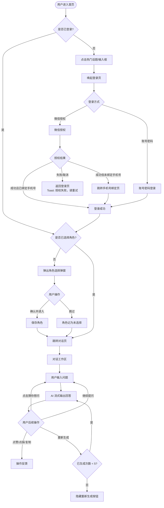

# 智能助手 PRD 文档

## 【版本说明】

| 字段   | 内容                          |
|------|-----------------------------|
| 版本号  | v1.0.0                      |
| 日期   | 2026-06-09                  |
| 作者   | 庞瑜婷                         |
| 状态   | 待评审                         |
| 说明   | 新增智能助手板块（登录、首页、角色选择、对话工作区、历史记录、设置偏好、后台管理） |
| 文档链接 | —                           |

---

## 一、产品定位与背景

### 背景

当前平台面向美妆行业专业人群（产品经理、配方研发工程师、法律合规人员、细分领域专家），存在专业知识获取效率低、配方法规查询分散等痛点。本期新增"智能助手"板块，通过接入大模型能力，为用户提供即时、专业的 AI 问答服务。

### 核心价值

> 基于精准 AI 算法与百万级成分数据库，为美妆行业专业人群提供定制化的配方分析与法规指导，大幅提升专业知识获取效率。

| 受益对象 | 核心收益                         |
|------|------------------------------|
| 用户   | 随时获取专业配方、法规问答，减少人工查阅成本       |
| 业务   | 提升平台黏性与专业壁垒，沉淀行业知识资产         |

### 量化目标

- 上线后 30 天，智能助手功能使用率 ≥ 40%
- 用户单次对话完成率（发出提问并获得回答）≥ 70%
- 用户满意度（点赞 / 总反馈）≥ 80%
- 平均接口响应时长 ≤ 30 秒

### 阶段规划

| Phase   | 目标              | 核心功能范围                           |
|---------|-----------------|----------------------------------|
| Phase 1 | MVP 核心链路跑通      | 登录（含微信授权）、首页、角色选择、对话工作区（基础问答）    |
| Phase 2 | 完善体验与历史管理       | 历史记录侧边栏、设置偏好、点赞/点踩反馈、重新生成与翻页     |
| Phase 3 | 后台管理与数据运营       | 博美智研后台会员管理新增角色字段、数据埋点与监控完善       |

---

## 二、用户与场景 / 页面结构

### A. 用户与场景

**目标用户画像**

| 角色         | 特征描述                              |
|------------|-----------------------------------|
| 美妆产品经理     | 负责产品规划、配方成分及生命周期管理，需要快速查阅市场与成分信息  |
| 配方研发工程师    | 专注研发创新，管理复杂工艺配方，需要深度专业技术支持        |
| 法律合规人员     | 审核安全标准，确保产品符合全球法规，需要精准法规条文查询      |
| 细分领域专家     | 毒理/生物/化学合成等，提供深度专业支持，需要学术级别的内容质量  |

**核心使用场景**

1. **场景一：首次使用（未登录）** — 用户访问首页，点击热门话题或输入框，触发登录引导，完成登录/注册后选择角色，进入对话。
2. **场景二：日常提问** — 已登录用户在首页或对话页直接输入问题发送，获得 AI 流式回答。
3. **场景三：深度研究** — 用户切换至"专家模式 + 专业语调"，查看模型思考过程，获取学术报告式回答。
4. **场景四：历史回顾** — 用户打开侧边栏，查找历史会话记录，重命名或删除会话。
5. **场景五：角色调整** — 用户在设置中修改核心角色，影响后续对话的推荐问题与回答风格。

### C. 页面结构

```
智能助手
├── 登录页
│   ├── 账号密码登录
│   └── 微信授权登录
│       └── 手机号绑定页（新用户）
├── 首页
│   ├── 智能输入框
│   └── 热门话题推荐区
│       └── 角色选择弹窗（未设置角色时触发）
├── 对话工作区
│   ├── 空状态（引导页）
│   │   ├── 欢迎卡片
│   │   └── 推荐问题
│   └── 对话状态
│       ├── 用户提问区
│       ├── 思考过程（可折叠）
│       ├── 系统回答区
│       ├── 结果操作栏（点赞/点踩/复制/重新生成）
│       ├── 猜你想问
│       └── 底部输入区
├── 历史记录侧边栏
│   ├── 新建对话按钮
│   └── 历史会话列表
│       └── 重命名 / 删除操作
└── 设置与偏好
    └── 核心角色配置项
```

---

## 三、功能范围

**本期包含（In Scope）：**

- [x] 登录模块：账号密码登录（保持原有逻辑）+ 微信授权登录（新增）
- [x] 首页：热门话题推荐区、智能输入框、角色未设置弹窗
- [x] 角色选择模块：首次注册强制弹窗、4 种角色枚举、跳过能力
- [x] 对话工作区：空状态引导页、流式问答、模式/语调切换、思考过程展示
- [x] 结果操作：点赞、点踩（含反馈弹窗）、复制、重新生成（最多 5 次）、翻页
- [x] 猜你想问：追问胶囊按钮
- [x] 字数限制与中断机制
- [x] 回到最新悬浮按钮
- [x] 历史记录侧边栏：列表展示、自动命名、重命名、删除
- [x] 设置与偏好：核心角色配置项
- [x] 博美智研后台：会员管理新增"核心角色"字段（列表页/新增页/编辑页）
- [x] 异常兜底：敏感词拦截、网络超时提示、并发限频

**本期不包含（Out of Scope）：**

- [ ] 多模态输入（图片/文件上传）— 延至 Phase 2 评估
- [ ] 对话内容导出功能 — 延至 Phase 2
- [ ] 智能助手数据看板（管理端）— 延至 Phase 3
- [ ] 多语言支持 — 暂无计划

---

## 四、用户流程

### 整体流程图



### 各场景步骤

> **场景一：微信授权登录（新用户）**
1. 用户点击首页输入框，系统检测未登录，唤起登录页
2. 用户点击"微信登录"，系统唤起微信内置授权弹窗
3. 用户确认授权，系统获取微信 openid，判断该 openid 未绑定手机号
4. 系统跳转手机号绑定页，用户输入手机号并获取验证码
5. 验证码校验通过，完成注册并自动登录，系统弹出角色选择弹窗
6. 用户选择角色并点击"确认并进入"，跳转首页

> **场景二：已登录用户发起对话**
1. 用户在首页输入框输入问题或点击热门话题
2. 系统检测用户已登录且已选择角色，携带问题内容跳转至对话页
3. 对话页直接开始生成回答，展示流式动效
4. 思考过程默认展开，思考完成后自动收起
5. 回答生成完毕，底部 Append 3 个"猜你想问"胶囊

> **场景三：切换模式与语调**
1. 用户在底部输入区切换"专家模式"和"专业语调"
2. 下一次发送的问题按新配置生成回答
3. 回答区采用学术报告排版，思考过程展示

---

## 五、界面与交互规范

### 5.1 登录页

- **页面用途**：用户身份认证入口
- **触发入口**：首页点击热门话题 / 输入框区域（未登录状态）
- **核心元素**：
  - 账号密码登录表单（用户名输入框、密码输入框、登录按钮）
  - 微信登录按钮（新增）
- **交互行为**：

| 用户操作           | 系统响应                                               |
|----------------|---------------------------------------------------|
| 点击"微信登录"       | 唤起微信内置授权弹窗                                        |
| 微信授权成功（已绑定手机号） | 直接完成登录，清除登录页，返回原始触发场景                             |
| 微信授权成功（未绑定手机号） | 跳转手机号绑定页                                          |
| 微信授权失败 / 取消    | 停留登录页，Toast 提示"授权失败，请重试"                          |

- **文案规范**：
  - 微信授权失败 Toast：「授权失败，请重试」
  - 手机号绑定页获取验证码按钮：「获取验证码」/ 倒计时「重新获取(Xs)」

### 5.2 首页

- **页面用途**：产品主入口，承接推荐问题与搜索发起
- **触发入口**：App / Web 主导航"智能助手"Tab
- **核心元素**：
  - 主标题
  - 智能输入框（点击跳转对话页）
  - 热门话题推荐区（卡片式展示，3 条）
- **推荐机制**：
  - 已设置角色：按角色定向推荐问题
  - 未设置角色 / 接口异常：展示 3 个全局通用美妆百科类问题（兜底）
- **交互行为**：

| 用户操作        | 登录状态 | 角色状态 | 系统响应                        |
|-------------|------|------|-----------------------------|
| 点击热门话题 / 输入框 | 未登录  | —    | 唤起登录页                       |
| 点击热门话题 / 发送问题 | 已登录  | 未选择  | 弹出角色选择弹窗                    |
| 点击热门话题 / 发送问题 | 已登录  | 已选择  | 携带问题内容跳转对话页，直接开始生成回答        |
| 点击输入框       | 已登录  | 已选择  | 跳转对话页（空状态）                  |

### 5.3 角色选择弹窗

- **页面用途**：采集用户核心角色，为后续推荐提供个性化依据
- **触发入口**：
  - 用户首次注册成功后强制弹出（仅一次）
  - 首页已登录但未选角色时，触发提问动作后弹出
- **核心元素**：
  - 主标题：「请选择你当前的核心角色」
  - 副标题：「选择对应的职业角色以获取定制化体验」
  - 角色单选列表（4 项）
  - 「确认并进入」按钮
  - 「跳过」文字链接
- **角色枚举**：

| 角色值      | 描述                          |
|----------|-----------------------------|
| 美妆产品经理   | 负责产品规划、配方成分及生命周期管理          |
| 配方研发工程师  | 专注于研发创新，管理复杂的工艺配方           |
| 法律合规人员   | 审核安全标准，确保产品符合全球法规           |
| 细分领域专家   | （毒理/生物/化学合成等）提供深度专业支持       |

- **交互行为**：

| 用户操作    | 系统响应                               |
|---------|------------------------------------|
| 选择角色后点击"确认并进入" | 保存角色信息，跳转首页或接续之前的提问动作   |
| 点击"跳过"  | 角色状态记为"未选择"，关闭弹窗，展示提示文案后继续     |

- **文案规范**：
  - 跳过提示：「你稍后可以在偏好设置中随时更改角色」

### 5.4 对话工作区 — 空状态（引导页）

- **页面用途**：新建对话时的初始状态，引导用户开始提问
- **触发入口**：点击侧边栏"新建对话"、首次进入对话页
- **核心元素**：
  - 欢迎卡片：
    - 标题：「Hi！我是你的美妆智能助理」
    - 文本：「基于精准 AI 算法与百万级成分数据库，为你提供专业的配方分析与法规指导。」
  - 推荐问题：根据角色动态展示 3 个问题卡片
  - 全局参数配置（输入框上方/侧边）：
    - 模式：快速模式（默认）/ 专家模式
    - 语调：亲和语调（默认）/ 专业语调
  - 底部输入区

### 5.5 对话工作区 — 对话状态

- **页面用途**：用户与 AI 进行多轮对话的核心工作区
- **核心元素及交互**：

**对话流展示**

| 区域       | 说明                                                                 |
|----------|--------------------------------------------------------------------|
| 用户提问区    | 展示用户输入的文本                                                          |
| 思考过程     | 在回答输出前展示折叠区块"思考过程"（调取模型 Reasoning 链路），默认展开，思考完成后自动收起，支持手动展开/折叠 |
| 系统回答区    | 流式动效输出；排版根据模式+语调联动切换（见下表）                                          |
| 引用资料     | 答案底部展示 `[1][2]` 脚注或「引用 X 篇资料」                                      |

**排版联动规则**

| 模式   | 语调   | 排版风格                              |
|------|------|-----------------------------------|
| 快速模式 | 亲和语调 | 小红书式（Emoji 穿插、重点加粗、短平快）           |
| 专家模式 | 专业语调 | 学术报告式（结构化分段、严谨术语）                 |
| 其他组合  | —    | 按实际模式/语调分别生效                      |

> 模式、语调、回答内容与思考过程相互绑定。用户可在同一次对话内切换，切换后的新提问按新配置生成，快速模式下不展示思考过程，专家模式下展示思考过程。

**结果操作栏（工具条）**

| 操作   | 默认态  | 触发后状态               | 备注                                                                 |
|------|------|---------------------|--------------------------------------------------------------------|
| 点赞   | 普通图标 | 高亮，Toast「反馈成功」      | 与点踩互斥                                                              |
| 点踩   | 普通图标 | 高亮，Toast「反馈成功」      | 弹出反馈弹窗（见下）；与点赞互斥                                                   |
| 复制   | 普通图标 | Toast「复制成功」         | 复制纯文本内容                                                            |
| 重新生成 | 显示   | 重新调用该轮 Prompt 生成新回答 | 单个问题最多生成 6 个版本（原始+重新生成 5 次），超出后隐藏按钮；提供 `< 1/N >` 翻页控件，最新版本排第一位展示 |

**点踩反馈弹窗字段**

| 字段   | 类型        | 规则                                   |
|------|-----------|--------------------------------------|
| 类别   | 单选（必选）    | 有害/不安全、虚假信息、没有帮助、其他                   |
| 补充说明 | 文本框（必填）   | 最少 1 字符，最多 300 字符                    |

**猜你想问**

- 系统回答完毕后，底部自动追加 3 个胶囊按钮
- 点击任意胶囊，直接将该问题作为新一轮提问发送

**底部输入区**

| 元素      | 说明                                                           |
|---------|--------------------------------------------------------------|
| 模式切换下拉  | 快速模式 / 专家模式                                                  |
| 语调切换下拉  | 亲和语调 / 专业语调                                                  |
| 输入框     | 最少 1 字符，最大 1000 字符；达到 1000 字符截断输入并飘红提示；未满 1 字符发送按钮置灰        |
| 发送/停止按钮 | 非输出状态：发送按钮；AI 输出状态：变为「⏹ 停止生成」，点击强制中断流式输出                    |

**回到最新**

- 用户向上滑动时，出现"回到最新"悬浮图标
- 点击后页面定位至最新一条内容

### 5.6 历史记录侧边栏

- **页面用途**：管理用户的历史对话会话
- **触发入口**：对话工作区侧边栏入口
- **核心元素**：
  - 顶部「+ 新建对话」常驻按钮：点击清空当前对话内容，返回引导页空状态
  - 历史会话列表
- **历史列表规则**：

| 规则   | 说明                                           |
|------|----------------------------------------------|
| 排序   | 按最后交互时间倒序（最新在上）                              |
| 自动命名 | 抓取该会话首个问题的首句，截取前 10 个字符，超出用「...」省略           |
| 重命名  | 长按/更多菜单触发，弹出输入框，最多 30 字符，为空不可提交             |
| 删除   | 二次确认弹窗「确定要永久删除该对话吗？」，确认后删除不可恢复              |

### 5.7 设置与偏好 — 核心角色

- **页面用途**：允许用户在注册后任意时间修改核心角色
- **触发入口**：首页 → 更多 → 设置 → 核心角色
- **核心元素**：
  - 列表项展示当前角色（未设置时显示「未选择」）
  - 点击进入二级页 / 底部弹窗，展示 4 种角色单选列表
- **交互行为**：修改后即时生效，影响后续新建对话的推荐机制与默认话术

### 5.8 博美智研后台 — 会员管理

- **页面用途**：运营人员管理用户核心角色字段
- **覆盖页面**：会员列表页、新增页、编辑页
- **字段规范**：

| 字段名  | 类型  | 枚举值                              | 是否必填 | 空值展示 |
|------|-----|----------------------------------|------|------|
| 核心角色 | 单选  | 美妆产品经理/配方研发工程师/法律合规人员/细分领域专家    | 否    | —    |

---

## 六、业务规则与校验

- **规则 1 — 角色推荐联动**：用户设置或修改核心角色后，首页热门推荐与对话引导页推荐问题均实时按新角色策略拉取；未设置角色时使用全局兜底策略（3 个通用美妆百科问题）。
- **规则 2 — 微信登录绑定判断**：以微信 openid 为唯一标识查询是否已绑定手机号；已绑定直接登录；未绑定跳转手机号绑定页完成注册。
- **规则 3 — 角色弹窗展示策略**：首次注册成功后强制弹出角色选择弹窗，仅展示一次，跳过或确认后不再主动弹出（后续可在设置中修改）。
- **规则 4 — 重新生成次数限制**：单个问题最多支持重新生成 5 次（共 6 个版本），超出后隐藏"重新生成"按钮，翻页控件仍保留。
- **规则 5 — 点赞/点踩互斥**：两者状态互斥，切换时自动取消另一方的高亮状态。
- **规则 6 — 退出登录**：路径为「首页 → 更多 → 设置 → 退出登录」，退出后清空本地 Token，返回首页非登录态。
- **校验逻辑**：

| 字段         | 校验规则                                |
|------------|-------------------------------------|
| 输入框（对话）    | 最少 1 字符，最大 1000 字符；达上限截断并飘红         |
| 点踩补充说明     | 最少 1 字符，最大 300 字符，必填               |
| 重命名会话      | 最多 30 字符，不可为空                       |
| 发送按钮状态     | 输入框为空时置灰；AI 输出中变为「停止生成」             |

---

## 七、边界条件与逻辑约束

| 边界条件           | 预期处理方式                                                        |
|----------------|----------------------------------------------------------------|
| 触发敏感词 / 违禁词    | 阻断大模型输出，前端统一展示：「暂时无法回答，请更换问题再提问。」                            |
| API 超时（>30 秒）  | 系统回答区显示失败提示：「网络开小差了，请检查网络或点击[重新生成]」                           |
| 网络断开           | 同 API 超时处理                                                     |
| 并发超频（同一账号 >20次/分钟） | 阻断请求，提示：「您问得太快了，请稍作休息」                                       |
| 未登录访问对话功能      | 唤起登录页                                                          |
| 已登录但未选角色触发提问   | 弹出角色选择弹窗                                                       |
| 重新生成超出 5 次     | 隐藏"重新生成"按钮，保留翻页控件                                              |
| 历史会话重命名为空      | 提交按钮禁用，不可提交                                                    |
| 点踩补充说明为空       | 提交按钮禁用，不可提交                                                    |
| 推荐接口返回异常       | 降级展示 3 个全局兜底问题                                                  |

---

## 八、非功能需求

| 类型      | 要求                                                        |
|---------|-----------------------------------------------------------|
| 性能      | 页面首屏加载 ≤ 3 秒；AI 接口首字节响应 ≤ 5 秒；整体超时阈值 ≤ 30 秒             |
| 兼容性     | 支持 iOS / Android App；支持主流移动浏览器（Chrome / Safari）           |
| 安全      | 本地 Token 加密存储；退出登录后清空；接口鉴权（Bearer Token）；敏感词服务端拦截；防 XSS  |
| 可用性     | SLA ≥ 99.9%；大模型接口不可用时展示降级提示，不影响其他功能使用                    |
| 并发限制    | 同一账号每分钟最高提问频率 20 次，超限服务端拒绝并返回提示文案                        |
| 埋点 & 监控 | 关键节点：登录成功、角色选择/跳过、发起提问、回答完成、点赞/点踩、复制、重新生成、停止生成、删除会话      |

---

## 九、需求缺口与待决策项

- [ ] 【待决策】推荐问题的具体内容与更新频率由谁维护（运营配置 or 算法自动生成）？→ 负责人：@庞瑜婷 | 截止：2026-06-16
- [ ] 【待决策】"专家模式"与"快速模式"的具体模型调用策略（是否切换不同模型 / 同模型不同 Prompt）？→ 负责人：@技术负责人 | 截止：2026-06-16
- [ ] 【信息缺失】微信授权登录的 AppID 及授权域名配置未确认 → 负责人：@后端负责人
- [ ] 【信息缺失】"猜你想问"3 个追问问题的生成逻辑（模型返回 or 规则生成）未明确 → 负责人：@庞瑜婷
- [ ] 【信息缺失】引用资料来源字段的数据结构与展示格式未定义 → 负责人：@后端负责人
- [ ] 【设计待出】对话工作区、历史侧边栏、角色选择弹窗视觉稿未提供 → 负责人：@设计师
- [ ] 【依赖项】博美智研后台新增字段依赖后台数据库字段变更先完成 → 预计：2026-06-20

---

## 十、验收标准 AC Table

| AC#  | 场景描述                       | 前置条件                  | 操作步骤                                            | 预期结果                                  | 优先级 |
|------|----------------------------|-----------------------|-------------------------------------------------|---------------------------------------|-----|
| AC01 | 未登录用户点击热门话题触发登录            | 用户未登录                 | 1. 进入首页 2. 点击任意热门话题卡片                           | 唤起登录页                                 | P0  |
| AC02 | 微信授权登录 — 已绑定手机号            | 用户未登录，微信账号已绑定手机号      | 1. 点击"微信登录" 2. 确认授权                             | 直接登录成功，返回触发场景                         | P0  |
| AC03 | 微信授权登录 — 未绑定手机号（新用户）       | 用户未登录，微信账号未绑定手机号      | 1. 点击"微信登录" 2. 确认授权 3. 输入手机号和验证码               | 完成注册并登录，弹出角色选择弹窗                      | P0  |
| AC04 | 微信授权失败返回提示                 | 用户未登录                 | 1. 点击"微信登录" 2. 取消/拒绝授权                          | 停留登录页，Toast「授权失败，请重试」                 | P1  |
| AC05 | 首次注册后强制弹出角色选择弹窗            | 用户完成首次注册登录            | —（注册完成后自动触发）                                    | 弹出角色选择弹窗，可正常选择角色或跳过                   | P0  |
| AC06 | 角色选择 — 确认并进入              | 角色选择弹窗已打开             | 1. 选择任意角色 2. 点击"确认并进入"                          | 角色保存成功，跳转首页/对话页，首页推荐问题按角色更新           | P0  |
| AC07 | 角色选择 — 跳过                  | 角色选择弹窗已打开             | 1. 点击"跳过"                                       | 弹窗关闭，展示提示文案，角色记为「未选择」，首页展示兜底推荐问题     | P1  |
| AC08 | 已登录未选角色用户发起提问触发角色弹窗        | 用户已登录，角色未选择           | 1. 在首页点击热门话题 / 发送问题                             | 弹出角色选择弹窗                              | P0  |
| AC09 | 发起对话 — 快速模式+亲和语调           | 用户已登录且已选角色，模式/语调为默认   | 1. 输入问题并发送                                      | 回答以小红书式排版输出，不展示思考过程                   | P0  |
| AC10 | 发起对话 — 专家模式+专业语调           | 用户已登录且已选角色            | 1. 切换至专家模式+专业语调 2. 输入问题并发送                     | 思考过程默认展开，思考完成后收起；回答以学术报告式排版输出         | P0  |
| AC11 | 思考过程手动展开/折叠                | 对话进行中，已有回答            | 1. 点击思考过程区块展开 / 点击折叠                            | 思考过程正常展开与折叠                           | P1  |
| AC12 | 流式输出中断机制                   | AI 正在输出回答             | 1. 点击「⏹ 停止生成」                                   | 流式输出停止，按钮恢复为发送状态                      | P0  |
| AC13 | 重新生成次数限制                   | 用户已对某问题重新生成 5 次       | —（达到上限后自动触发）                                    | 「重新生成」按钮隐藏，翻页控件显示「< 1/6 >」            | P1  |
| AC14 | 翻页查看不同版本回答                 | 已有多个版本回答              | 1. 点击翻页控件 `<` / `>`                              | 切换至对应版本回答，最新版本排第一位                    | P1  |
| AC15 | 点赞与点踩互斥                    | 已点赞                   | 1. 点击点踩                                         | 点赞状态取消，点踩高亮，弹出反馈弹窗                    | P1  |
| AC16 | 点踩反馈弹窗提交校验                 | 点踩反馈弹窗已打开             | 1. 不选类别直接提交 / 2. 补充说明为空提交                       | 提交按钮禁用，无法提交                           | P1  |
| AC17 | 复制回答内容                     | 已有回答                  | 1. 点击「复制」                                       | 纯文本内容复制到剪贴板，Toast「复制成功」               | P2  |
| AC18 | 猜你想问点击发送                   | 回答已完成，猜你想问已展示         | 1. 点击任意追问胶囊                                     | 胶囊内容作为新一轮提问发送，进入下一轮对话                 | P1  |
| AC19 | 输入框字数上限                    | 对话页输入框                | 1. 输入超过 1000 字符                                  | 截断输入，提示飘红，无法继续输入                      | P1  |
| AC20 | 新建对话                       | 侧边栏已打开                | 1. 点击「+ 新建对话」                                   | 当前对话内容清空，返回引导页空状态                     | P0  |
| AC21 | 历史会话自动命名                   | 用户完成一次对话              | —（系统自动触发）                                       | 侧边栏展示该会话标题，为首个问题首句前 10 字符，超出显示「...」   | P1  |
| AC22 | 删除历史会话 — 二次确认              | 历史会话列表已展示             | 1. 长按会话 2. 点击删除 3. 确认删除                          | 会话从列表移除，不可恢复                          | P1  |
| AC23 | 设置中修改核心角色即时生效              | 用户已登录                 | 1. 进入设置 → 核心角色 2. 修改角色                          | 修改保存，新建对话后推荐问题按新角色更新                  | P1  |
| AC24 | 敏感词触发兜底文案                  | 对话进行中                 | 1. 发送包含敏感词的问题                                   | 阻断输出，显示「暂时无法回答，请更换问题再提问。」             | P0  |
| AC25 | API 超时提示                   | 网络正常但接口超时 >30 秒       | 1. 发送问题后等待                                      | 显示「网络开小差了，请检查网络或点击[重新生成]」             | P0  |
| AC26 | 并发超频限制                     | 同一账号已在 1 分钟内提问 20 次   | 1. 继续发送第 21 次问题                                  | 请求被拒绝，提示「您问得太快了，请稍作休息」                | P0  |
| AC27 | 退出登录清空 Token               | 用户已登录                 | 1. 首页 → 更多 → 设置 → 退出登录                          | 清空本地 Token，返回首页非登录态                    | P0  |
| AC28 | 后台会员管理核心角色字段展示             | 后台管理员已登录              | 1. 进入会员中心 → 会员管理列表 2. 查看任意用户                    | 列表展示「核心角色」列，未填用户显示「-」                 | P1  |
| AC29 | 回到最新悬浮按钮                   | 对话页有多条消息，用户已向上滑动      | 1. 向上滑动页面 2. 点击「回到最新」图标                          | 页面定位至最新一条内容                           | P2  |

---

## 十一、后续阶段规划

| Phase   | 目标               | 核心功能范围                               | 成功指标                    |
|---------|------------------|--------------------------------------|-------------------------|
| Phase 1 | MVP 核心链路跑通       | 微信登录、首页、角色选择、对话基础问答（流式输出、模式/语调切换）   | 功能使用率 ≥ 40%；对话完成率 ≥ 70% |
| Phase 2 | 完善体验与历史管理        | 历史记录管理、点赞/点踩反馈、重新生成翻页、猜你想问、设置偏好修改角色 | 用户满意度 ≥ 80%；次日留存 ≥ 30%  |
| Phase 3 | 后台管理与数据运营        | 博美智研后台角色字段、埋点数据看板、推荐策略优化             | 运营可配置推荐问题；埋点覆盖率 100%    |

---

*Skill Version: v1.0 | Role: AI Product Manager | Language: 中文*
