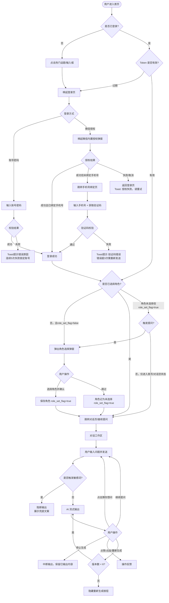

# 智能助手 PRD 文档

## 【版本说明】

| 字段   | 内容                          |
|------|-----------------------------|
| 版本号  | v1.1.0                      |
| 日期   | 2026-06-11                  |
| 作者   | 庞瑜婷                         |
| 状态   | 待评审                         |
| 说明   | 在 v1.0.0 基础上，补全登录校验、Token 生命周期、模式/语调组合规则、输出中断边界、翻页细节、历史记录限制、并发倒计时等 35 处细节漏洞 |
| 文档链接 | —                           |

### 变更记录

| 版本     | 日期         | 修改内容摘要                                       |
|--------|------------|----------------------------------------------|
| v1.0.0 | 2026-06-09 | 初始版本，新增智能助手板块                                |
| v1.1.0 | 2026-06-11 | 补全交互边界、校验规则、异常分支，修正输入框字符逻辑表述错误，新增数据模型与接口约束 |

---

## 一、产品定位与背景

### 背景

当前平台面向美妆行业专业人群（产品经理、配方研发工程师、法律合规人员、细分领域专家），存在专业知识获取效率低、配方法规查询分散等痛点。本期新增"智能助手"板块，通过接入大模型能力，为用户提供即时、专业的 AI 问答服务。

### 核心价值

> 基于精准 AI 算法与百万级成分数据库，为美妆行业专业人群提供定制化的配方分析与法规指导，大幅提升专业知识获取效率。

| 受益对象 | 核心收益                   |
|------|--------------------------|
| 用户   | 随时获取专业配方、法规问答，减少人工查阅成本 |
| 业务   | 提升平台黏性与专业壁垒，沉淀行业知识资产   |

### 量化目标

- 上线后 30 天，智能助手功能使用率 ≥ 40%
- 用户单次对话完成率（发出提问并获得回答）≥ 70%
- 用户满意度（点赞 / 总反馈）≥ 80%
- AI 接口首字节响应 ≤ 5 秒，整体超时阈值 ≤ 30 秒

### 阶段规划

| Phase   | 目标         | 核心功能范围                                          |
|---------|------------|--------------------------------------------------|
| Phase 1 | MVP 核心链路跑通 | 登录（含微信授权）、首页、角色选择、对话工作区（基础问答、模式/语调切换、停止生成）      |
| Phase 2 | 完善体验与历史管理  | 历史记录侧边栏、设置偏好修改角色、点赞/点踩反馈、重新生成与翻页、猜你想问           |
| Phase 3 | 后台管理与数据运营  | 博美智研后台会员管理新增角色字段、数据埋点看板、推荐策略可配置化                |

---

## 二、用户与场景 / 数据模型 / 页面结构

### A. 用户与场景

**目标用户画像**

| 角色      | 特征描述                                  |
|---------|---------------------------------------|
| 美妆产品经理  | 负责产品规划、配方成分及生命周期管理，需要快速查阅市场与成分信息    |
| 配方研发工程师 | 专注研发创新，管理复杂工艺配方，需要深度专业技术支持            |
| 法律合规人员  | 审核安全标准，确保产品符合全球法规，需要精准法规条文查询          |
| 细分领域专家  | 毒理 / 生物 / 化学合成等方向，提供深度专业支持，需要学术级别内容质量 |

**核心使用场景**

1. **场景一：首次使用（未登录）** — 用户访问首页，点击热门话题或输入框，触发登录引导，完成登录/注册后选择角色，进入对话。
2. **场景二：日常提问** — 已登录用户在首页或对话页直接输入问题发送，获得 AI 流式回答。
3. **场景三：深度研究** — 用户切换至"专家模式 + 专业语调"，查看模型思考过程，获取学术报告式回答。
4. **场景四：历史回顾** — 用户打开侧边栏，查找历史会话记录，重命名或删除会话。
5. **场景五：角色调整** — 用户在设置中修改核心角色，影响后续新建对话的推荐问题与回答风格。

### B. 数据模型

**核心实体**

**User（用户）**

| 字段             | 类型       | 说明                                                         |
|----------------|----------|------------------------------------------------------------|
| user_id        | string   | 唯一标识                                                       |
| phone          | string   | 手机号（脱敏存储）                                                  |
| wechat_openid  | string   | 微信 openid，可为空（账号密码注册用户）                                    |
| core_role      | enum     | 美妆产品经理 / 配方研发工程师 / 法律合规人员 / 细分领域专家 / 未选择（默认）              |
| role_set_flag  | boolean  | 是否已完成角色选择弹窗交互（true = 已选择或主动跳过；false = 从未展示过）             |
| token          | string   | 访问令牌（加密存储于本地）                                              |
| token_expire   | datetime | Token 过期时间                                                 |
| created_at     | datetime | 注册时间                                                       |

**Conversation（会话）**

| 字段              | 类型       | 说明                              |
|-----------------|----------|---------------------------------|
| conv_id         | string   | 会话唯一标识                          |
| user_id         | string   | 关联用户                            |
| title           | string   | 会话标题（自动命名，最多 30 字符）             |
| mode            | enum     | 快速模式 / 专家模式（记录本次会话最后使用的配置）      |
| tone            | enum     | 亲和语调 / 专业语调                     |
| last_active_at  | datetime | 最后交互时间（用于列表排序）                  |
| created_at      | datetime | 创建时间                            |

**Message（消息）**

| 字段               | 类型       | 说明                                               |
|-----------------|----------|----------------------------------------------------|
| msg_id          | string   | 消息唯一标识                                           |
| conv_id         | string   | 关联会话                                             |
| role            | enum     | user / assistant                                   |
| content         | string   | 消息正文（用户问题或 AI 回答，纯文本存储）                         |
| mode            | enum     | 该条消息生成时所用模式                                      |
| tone            | enum     | 该条消息生成时所用语调                                      |
| reasoning       | string   | 思考过程原文（仅 assistant 消息 + 专家模式时有值）                |
| version_index   | int      | 重新生成版本号，从 1 开始，同一问题多版本共享同一 question_msg_id        |
| question_msg_id | string   | 关联的用户提问消息 id（用于版本归组）                            |
| liked           | enum     | none / up / down（点赞/点踩状态）                        |
| feedback        | object   | 点踩反馈内容 { category, comment }                     |
| references      | array    | 引用资料列表 [{ title, url, snippet }]                  |
| created_at      | datetime | 消息创建时间                                           |

**实体关系**

```
User 1 ──── N Conversation
Conversation 1 ──── N Message
Message (version_index > 1) ──── 1 Message (question_msg_id, version_index = 1)
```

### C. 页面结构

```
智能助手
├── 登录页
│   ├── 账号密码登录表单
│   │   └── 忘记密码入口
│   └── 微信授权登录
│       └── 手机号绑定页（新用户）
│           └── 验证码输入 + 重新发送
├── 首页
│   ├── 智能输入框（点击跳转对话页空状态）
│   └── 热门话题推荐区（卡片列表）
│       └── 角色选择弹窗（已登录未选角色时触发）
├── 对话工作区
│   ├── 空状态（引导页）
│   │   ├── 欢迎卡片
│   │   ├── 推荐问题卡片（×3）
│   │   └── 模式 / 语调选择控件
│   └── 对话状态
│       ├── 消息列表
│       │   ├── 用户消息气泡
│       │   ├── 思考过程区块（可折叠，专家模式专属）
│       │   ├── AI 回答气泡
│       │   ├── 引用资料区
│       │   ├── 工具栏（点赞/点踩/复制/重新生成 + 翻页控件）
│       │   └── 猜你想问胶囊（×3）
│       ├── 回到最新悬浮按钮（上滑时出现）
│       └── 底部输入区
│           ├── 模式切换下拉
│           ├── 语调切换下拉
│           ├── 输入框（多行，支持 Shift+Enter 换行）
│           └── 发送 / 停止生成按钮
├── 历史记录侧边栏
│   ├── + 新建对话按钮（常驻顶部）
│   ├── 历史会话列表（倒序）
│   │   ├── 会话标题
│   │   └── 更多操作（重命名 / 删除）
│   └── 空状态占位（无历史时）
└── 设置与偏好
    ├── 核心角色配置项
    └── 退出登录
```

---

## 三、功能范围

**本期包含（In Scope）：**

- [x] 登录模块：账号密码登录（保持原有逻辑）+ 微信授权登录（新增）
- [x] 首页：热门话题推荐区、智能输入框（跳转入口）、角色未设置弹窗
- [x] 角色选择模块：首次注册强制弹窗、4 种角色枚举、跳过能力
- [x] 对话工作区：空状态引导页、流式问答、模式/语调切换、思考过程展示（专家模式）
- [x] 结果操作：点赞、点踩（含反馈弹窗）、复制、重新生成（最多 5 次）、翻页
- [x] 猜你想问：追问胶囊按钮
- [x] 字数限制（1~1000 字符）与中断机制（停止生成）
- [x] 回到最新悬浮按钮
- [x] 历史记录侧边栏：列表展示、自动命名、重命名、删除、空状态
- [x] 设置与偏好：核心角色配置项、退出登录（含二次确认）
- [x] 博美智研后台：会员管理新增"核心角色"字段（列表页/新增页/编辑页）
- [x] 异常兜底：敏感词拦截、网络超时提示、并发限频（含倒计时提示）

**本期不包含（Out of Scope）：**

- [ ] 多模态输入（图片 / 文件上传）— 延至 Phase 2 评估
- [ ] 对话内容导出功能 — 延至 Phase 2
- [ ] 智能助手数据看板（管理端）— 延至 Phase 3
- [ ] 多语言支持 — 暂无计划
- [ ] 离线缓存 / 本地优先策略 — 暂无计划

---

## 四、用户流程

### 整体流程图



### 各场景步骤

> **场景一：微信授权登录（新用户）**
1. 用户点击首页输入框，系统检测未登录，唤起登录页
2. 用户点击"微信登录"，系统判断当前环境：若在微信内，唤起微信内置授权弹窗；若在普通浏览器，展示提示「请在微信客户端内打开以使用微信登录」并保持在登录页
3. 用户在微信内确认授权，系统获取 openid，查询未绑定手机号
4. 跳转手机号绑定页，用户输入手机号，点击「获取验证码」（60 秒倒计时，倒计时内按钮禁用显示「重新获取(Xs)」）
5. 输入 6 位验证码，校验通过，完成注册并自动登录，`role_set_flag` 初始化为 `false`
6. 系统弹出角色选择弹窗，用户选择角色并点击「确认并进入」，`core_role` 保存，`role_set_flag` 置为 `true`，跳转首页

> **场景二：已登录用户发起对话（快速模式+亲和语调）**
1. 用户在首页点击热门话题卡片
2. 系统检测已登录、`role_set_flag=true`，携带问题内容跳转对话页
3. 对话页直接发送问题，AI 开始流式输出，不展示思考过程区块
4. 输出完毕，工具栏（点赞/点踩/复制/重新生成）显示，底部追加 3 个"猜你想问"胶囊

> **场景三：专家模式发起深度研究**
1. 用户在底部输入区将模式切换至「专家模式」、语调切换至「专业语调」
2. 输入问题并发送
3. 思考过程区块出现并默认展开，展示 loading 动效（滚动文字或波纹），思考完成后自动折叠
4. AI 以学术报告排版流式输出回答，用户可点击思考过程区块标题手动展开/折叠

> **场景四：AI 输出中途停止生成**
1. AI 正在流式输出，发送按钮变为「⏹ 停止生成」
2. 用户点击停止，流式输出立即中断，已输出内容保留
3. 工具栏显示，用户可对已输出内容进行点赞/点踩/复制/重新生成
4. "猜你想问"在停止生成后**不展示**（因为回答不完整）

> **场景五：重新生成与翻页**
1. 用户点击「重新生成」，当前问题重新调用模型生成，新版本排在翻页控件第 1 位（最新）
2. 翻页控件更新为 `< 1/2 >`，最左侧为最新版本
3. 用户点击 `>` 切换至第 2 版（上一次的回答）；在最旧版本时 `>` 禁用
4. 用户在浏览历史版本时，仍可在底部输入框发起新一轮提问；新提问不影响当前问题的版本记录

---

## 五、界面与交互规范

### 5.1 登录页

- **页面用途**：用户身份认证入口
- **触发入口**：首页点击热门话题 / 输入框区域（未登录状态）；Token 过期时系统自动跳转
- **核心元素**：
  - 账号密码登录表单（手机号/账号输入框、密码输入框、登录按钮）
  - 「忘记密码」文字链接（复用原有逻辑，本文不展开）
  - 微信登录按钮（新增）
- **交互行为**：

| 用户操作              | 系统响应                                              |
|-------------------|---------------------------------------------------|
| 点击「微信登录」（微信环境内）  | 唤起微信内置授权弹窗                                        |
| 点击「微信登录」（非微信环境）  | 不跳转，Toast 提示「请在微信客户端内打开以使用微信登录」                   |
| 微信授权成功（已绑定手机号）   | 直接完成登录，清除登录页，返回原始触发场景（首页或对话页）                     |
| 微信授权成功（未绑定手机号）   | 跳转手机号绑定页                                          |
| 微信授权失败 / 用户取消    | 停留登录页，Toast「授权失败，请重试」                             |
| 账号密码登录成功         | 返回原始触发场景                                          |
| 账号密码连续错误 5 次      | 账号锁定 30 分钟，提示「账号已被锁定，请 30 分钟后重试」，登录按钮禁用           |

**手机号绑定页（新用户微信授权后）**

| 元素         | 规则                                                               |
|------------|------------------------------------------------------------------|
| 手机号输入框     | 仅支持大陆 11 位手机号（1 开头），格式不符不可发送验证码                               |
| 获取验证码按钮    | 点击后发送短信，按钮进入 60 秒倒计时（显示「重新获取(Xs)」），倒计时内禁用                      |
| 验证码输入框     | 6 位数字，输入满 6 位自动提交校验                                             |
| 验证码有效期     | 5 分钟，超时后提示「验证码已过期，请重新获取」                                        |
| 验证码连续错误    | 单次验证码最多输错 3 次，超出后需重新获取新验证码，提示「验证码错误次数过多，请重新发送」                  |
| 重新发送频率限制   | 同一手机号 1 分钟内仅可发送 1 次，同一 IP 每日最多发送 10 次（服务端校验）                    |

**Token 生命周期**

| 场景          | 处理方式                                           |
|-------------|------------------------------------------------|
| Token 有效期   | 7 天（服务端配置）                                     |
| Token 即将过期  | 最后 1 天内发起请求时，服务端静默续签（返回新 Token，前端更新本地存储）       |
| Token 已过期   | 请求返回 401，前端清空本地 Token，跳转登录页，登录成功后返回原页面         |
| 退出登录        | 清空本地 Token，服务端撤销 Token（使其立即失效），返回首页非登录态         |
| App 在后台切换账号 | 重新进入前台时检测 Token 归属，若与当前本地 user_id 不符则清空并跳登录页   |

- **文案规范**：
  - 微信非微信环境 Toast：「请在微信客户端内打开以使用微信登录」
  - 微信授权失败 Toast：「授权失败，请重试」
  - 账号锁定提示：「账号已被锁定，请 30 分钟后重试」
  - 验证码超时提示：「验证码已过期，请重新获取」
  - 验证码错误次数超限：「验证码错误次数过多，请重新发送」

---

### 5.2 首页

- **页面用途**：产品主入口，承接推荐问题与搜索发起
- **触发入口**：App / Web 主导航"智能助手" Tab
- **核心元素**：
  - 主标题
  - 智能输入框（仅作为跳转入口，**不支持**在首页直接输入发送；点击后跳转至对话页空状态）
  - 热门话题推荐区（卡片式展示，固定 3 条，无刷新/换一换功能，按推荐接口返回内容渲染）
- **推荐机制**：
  - 已设置角色：按 `core_role` 调用推荐接口，拉取 3 条定向推荐问题
  - 未设置角色（`core_role = 未选择`）或接口返回异常：降级展示 3 个全局通用美妆百科类问题（前端硬编码兜底）
- **加载态**：热门话题推荐区数据拉取期间展示骨架屏（3 个灰色卡片占位），接口响应超过 3 秒仍未返回则展示兜底问题
- **交互行为**：

| 用户操作             | 登录状态 | 角色状态                         | 系统响应                   |
|------------------|------|------------------------------|--------------------------|
| 点击热门话题 / 点击输入框   | 未登录  | —                            | 唤起登录页                  |
| 点击热门话题（输入问题内容）  | 已登录  | 未选择（`role_set_flag = true`）  | 弹出角色选择弹窗（接续该提问动作）      |
| 点击热门话题（输入问题内容）  | 已登录  | 已选择                          | 携带问题内容跳转对话页，直接开始生成回答   |
| 单纯点击输入框（不输入内容）  | 已登录  | 任意                           | 跳转对话页（空状态），不触发角色弹窗     |

---

### 5.3 角色选择弹窗

- **页面用途**：采集用户核心角色，为后续推荐提供个性化依据
- **触发入口**：
  - 用户首次注册成功后强制弹出（仅展示一次，`role_set_flag = false` 时触发）
  - 已登录用户 `role_set_flag = true` 但 `core_role = 未选择` 时，触发提问动作后弹出（不触发于单纯点击输入框跳空状态的场景）
- **弹窗样式**：底部抽屉式弹出，背景遮罩层不可点击关闭（防止用户绕过弹窗）
- **核心元素**：
  - 主标题：「请选择你当前的核心角色」
  - 副标题：「选择对应的职业角色以获取定制化体验」
  - 角色单选列表（4 项，初始无默认选中）
  - 「确认并进入」按钮（**未选择任何角色时置灰禁用**）
  - 「跳过」文字链接（始终可点）
- **角色枚举**：

| 角色值     | 描述                         |
|---------|----------------------------|
| 美妆产品经理  | 负责产品规划、配方成分及生命周期管理         |
| 配方研发工程师 | 专注于研发创新，管理复杂的工艺配方          |
| 法律合规人员  | 审核安全标准，确保产品符合全球法规          |
| 细分领域专家  | （毒理/生物/化学合成等）提供深度专业支持      |

- **交互行为**：

| 用户操作            | 系统响应                                                    |
|-----------------|-----------------------------------------------------------|
| 未选角色，点击「确认并进入」 | 按钮置灰，不可点击，无响应                                           |
| 选择角色后点击「确认并进入」 | 保存 `core_role`，`role_set_flag = true`，关闭弹窗，接续之前的提问动作或跳转首页 |
| 点击「跳过」         | `core_role` 保持「未选择」，`role_set_flag = true`，关闭弹窗，展示提示文案，继续流程 |
| App 切至后台（弹窗未处理） | 弹窗状态保留，用户回到前台时弹窗仍然显示（`role_set_flag` 未变化则重新触发）           |

- **文案规范**：
  - 跳过提示（弹窗下方或 Toast）：「你稍后可以在偏好设置中随时更改角色」

---

### 5.4 对话工作区 — 空状态（引导页）

- **页面用途**：新建对话时的初始状态，引导用户开始提问
- **触发入口**：
  - 首页点击输入框（不触发角色弹窗的路径）
  - 侧边栏点击「+ 新建对话」
  - 登录/角色流程完成后的跳转落地
- **核心元素**：
  - 欢迎卡片：
    - 标题：「Hi！我是你的美妆智能助理」
    - 文本：「基于精准 AI 算法与百万级成分数据库，为你提供专业的配方分析与法规指导。」
  - 推荐问题：根据角色动态展示 3 个问题卡片（同首页推荐机制，含骨架屏加载态与兜底策略）
  - 模式选择控件（位于输入框上方）：
    - 快速模式（默认，标注「即时响应」）
    - 专家模式（标注「深度研究」）
  - 语调选择控件（位于输入框上方）：
    - 亲和语调（默认）
    - 专业语调
  - 底部输入区（同对话状态）
- **交互行为**：点击推荐问题卡片，将该问题填入输入框并直接发送，引导页切换为对话状态

---

### 5.5 对话工作区 — 对话状态

- **页面用途**：用户与 AI 进行多轮对话的核心工作区
- **消息气泡样式**：
  - 用户消息：右对齐气泡，展示纯文本，气泡下方展示发送时间（精确到分钟）
  - AI 消息：左对齐，无气泡外框，自然排版，消息上方展示时间戳（精确到分钟）
- **单次会话最大轮数**：不设硬性上限，但服务端单次 context 窗口超出后，自动截断最早的对话轮次（前端无需提示，后端处理）

---

#### 5.5.1 思考过程区块

| 状态      | 展示逻辑                                                      |
|---------|-----------------------------------------------------------|
| 快速模式    | **不渲染**思考过程区块，该区域完全不出现                                   |
| 专家模式思考中 | 在 AI 消息区域顶部渲染「思考过程」区块，默认展开，内部展示 loading 动效（波纹 + 文字「思考中…」） |
| 专家模式思考完成 | 自动折叠为一行折叠态（显示「已完成思考，点击展开」），用户可手动点击展开/折叠              |
| 停止生成后   | 若已进入思考阶段，保留已有思考内容；若尚在思考阶段则清空思考内容，区块显示「思考已中断」            |

---

#### 5.5.2 模式与语调联动规则（完整矩阵）

| 模式   | 语调   | 思考过程 | 排版风格                                          |
|------|------|------|-----------------------------------------------|
| 快速模式 | 亲和语调 | 不展示  | 小红书式（Emoji 穿插、重点加粗、短平快段落）                    |
| 快速模式 | 专业语调 | 不展示  | 简洁专业式（无 Emoji，使用专业术语，结构清晰但简短）               |
| 专家模式 | 亲和语调 | 展示   | 友好深度式（有 Emoji，结构化分段，语气亲和但内容深度）              |
| 专家模式 | 专业语调 | 展示   | 学术报告式（无 Emoji，结构化分段，严谨术语，引用资料）              |

> **重要约束**：思考过程的展示与否仅由"模式"决定（与语调无关）。同一对话内，每轮消息独立记录生成时的模式和语调，历史消息的排版不因当前切换而改变。

---

#### 5.5.3 流式输出行为

| 场景                 | 处理方式                                                |
|--------------------|-----------------------------------------------------|
| 输出中，用户向上滑动         | 支持滚动查看历史内容；同时底部出现「回到最新」悬浮按钮                         |
| 输出中，工具栏状态          | 点赞/点踩/复制/重新生成按钮**隐藏**，仅显示「⏹ 停止生成」                  |
| 输出中，AI输出中途触发敏感词    | 立即中断输出，清空已输出内容，显示兜底文案「暂时无法回答，请更换问题再提问。」            |
| 点击「停止生成」           | 立即中断流式连接，**已输出内容保留**，工具栏显示，「猜你想问」**不展示**           |
| 输出完成               | 工具栏显示，底部自动追加 3 个「猜你想问」胶囊                            |
| 输出中，用户在输入框输入新内容并发送 | 当前输出立即中断（同点击停止），已输出内容保留，新问题开始生成                     |

---

#### 5.5.4 结果操作栏（工具条）

**点赞/点踩**

| 操作            | 初始态  | 点击后状态          | 特殊规则                                      |
|---------------|------|----------------|-------------------------------------------|
| 点赞            | 普通图标 | 高亮，Toast「反馈成功」 | 与点踩互斥：若已点踩，点击点赞后自动取消点踩并提交点赞              |
| 点踩            | 普通图标 | 弹出反馈弹窗         | 弹窗提交成功后点踩图标变高亮，Toast「反馈成功」；与点赞互斥          |
| 点踩弹窗 — 点击 X  | —    | 弹窗关闭           | **点踩状态不高亮**（视为取消），已点赞状态不变                 |
| 点踩弹窗 — 点击遮罩层 | —    | 同点击 X          | —                                         |
| 取消点赞（再次点击已高亮点赞） | 高亮  | 恢复普通图标，Toast「已取消反馈」 | —                                    |

**点踩反馈弹窗字段**

| 字段   | 类型      | 规则                              |
|------|---------|------------------------------|
| 类别   | 单选（必选）  | 有害/不安全、虚假信息、没有帮助、其他；未选时提交按钮禁用 |
| 补充说明 | 文本框（必填） | 最少 1 字符，最多 300 字符；为空时提交按钮禁用   |
| 提交按钮 | —       | 类别和补充说明均满足条件时可点；提交后弹窗自动关闭     |

**复制**

- 点击后将当前版本回答的纯文本（去除 Markdown 格式符号）写入剪贴板
- Toast「复制成功」，2 秒后消失
- 若剪贴板写入失败（权限拒绝），Toast「复制失败，请手动选中文字」

**重新生成与翻页**

| 规则          | 说明                                                               |
|-------------|------------------------------------------------------------------|
| 可用条件        | 仅在 AI 输出完成后（含停止生成后）显示；输出中隐藏                                     |
| 次数限制        | 单个问题最多重新生成 5 次，总版本数 ≤ 6；达到上限后「重新生成」按钮隐藏，翻页控件保留               |
| 版本排列方向      | 最新生成的版本排在翻页控件**最左（第 1 位）**，最早原始版本排在**最右（第 N 位）**               |
| 翻页控件禁用      | 当前为第 1 位（最新）时，左箭头 `<` 禁用；当前为第 N 位（最旧）时，右箭头 `>` 禁用             |
| 浏览历史版本时发新问题 | 用户可正常在输入框发起新一轮提问，不影响当前问题的版本记录；翻页控件归位至第 1 位                      |
| 翻页时工具栏状态    | 切换版本后，点赞/点踩状态独立绑定至当前版本，各版本状态互不影响                               |

---

#### 5.5.5 猜你想问

- 系统回答**完全完成**后（非停止生成），在回答区底部自动追加 3 个胶囊按钮
- 胶囊来源：由模型在生成回答时同步返回（随回答流式数据一并下发），前端在输出完成后渲染
- 点击胶囊：将该文本填入输入框并直接发送，胶囊区域在发送后**消失**（不保留在对话记录中）
- 若用户在胶囊展示后手动输入新问题发送，胶囊区域消失

---

#### 5.5.6 底部输入区

| 元素       | 说明                                                                |
|----------|-------------------------------------------------------------------|
| 模式切换下拉   | 快速模式 / 专家模式；AI 输出期间**禁用**，输出完成后可切换                              |
| 语调切换下拉   | 亲和语调 / 专业语调；AI 输出期间**禁用**，输出完成后可切换                              |
| 输入框      | 多行文本框；Enter 键发送，Shift+Enter 换行；最少 1 字符，最大 1000 字符（按 Unicode 字符数计算，中文字符计 1 个，emoji 计 1 个） |
| 字符数提示    | 输入达到 800 字符时，右下角出现「X/1000」灰色计数；达到 1000 字符时截断输入，计数文字变红，不可继续输入    |
| 发送按钮状态   | 输入框为空时置灰禁用；有内容时可点击；AI 输出中变为「⏹ 停止生成」红色按钮                          |
| 发送按钮禁用条件 | 输入框为空 **或** AI 正在输出时（此时为停止按钮，不为置灰状态）                             |

> **v1.0.0 勘误说明**：原文「少于 1000 字符发送按钮置灰」表述有误，应为「输入框为空（0 字符）时发送按钮置灰」，已在本版本修正。

---

#### 5.5.7 回到最新悬浮按钮

| 行为       | 说明                                          |
|----------|---------------------------------------------|
| 出现条件     | 用户向上滑动超过 **1 屏高度**时，按钮从右下角浮入                |
| 消失条件     | 用户手动滚动至底部（距底部 < 50px）时，按钮自动淡出              |
| 点击行为     | 页面平滑滚动至最新消息底部                               |
| AI 输出期间  | 若有新内容持续追加，按钮添加「有新内容」小红点动效提示                 |

---

#### 5.5.8 引用资料

| 展示形式        | 触发条件                    |
|-------------|-------------------------|
| `[1][2]` 脚注 | 回答正文内有明确引用点时，脚注嵌入在对应文字后 |
| 「引用 X 篇资料」  | 有引用但正文内无精确锚点时，显示在回答区底部  |

- 点击脚注或「引用 X 篇资料」：展开引用资料抽屉（底部上拉），每条资料显示标题、来源简介、跳转链接（新窗口打开）
- 若 `references` 列表为空，不展示引用区域

---

### 5.6 历史记录侧边栏

- **页面用途**：管理用户的历史对话会话
- **触发入口**：对话工作区左上角侧边栏图标，点击展开/收起
- **核心元素**：
  - 顶部「+ 新建对话」常驻按钮
  - 历史会话列表（倒序）
  - 空状态占位区（无历史时）
- **历史列表规则**：

| 规则        | 说明                                                               |
|-----------|------------------------------------------------------------------|
| 排序        | 按 `last_active_at` 倒序（最新在上）                                     |
| 自动命名      | 抓取该会话**首个用户消息**的内容，截取前 **10 个字符**（按 Unicode 字符数），超出用「...」省略；不足 10 字符则完整展示（不加省略号）；若首个问题含换行符，以换行符为截断边界 |
| 存储上限      | 单个用户最多保留 **100 条**历史会话；超出后，删除最早的 1 条（按 `created_at` 最旧），前端在删除后刷新列表，不主动提示用户 |
| 存储期限      | 永久保留（在上限范围内），不设自动过期                                              |
| 重命名       | 长按会话 item 或点击更多菜单图标 → 点击「修改名称」→ 弹出输入框（预填当前标题），最多 30 字符，为空不可提交   |
| 删除        | 二次确认弹窗「确定要永久删除该对话吗？」，点击「确认」后逻辑删除（标记 deleted_at，服务端定时物理清理），前端立即从列表移除 |
| 空状态       | 无历史会话时，列表区域展示：图标 + 文案「暂无对话记录，快来开始第一次提问吧」                        |

**新建对话的中断处理**

| 当前状态              | 点击「+ 新建对话」后的处理                                      |
|-------------------|-------------------------------------------------------|
| AI 正在输出（流式进行中）    | 强制中断当前流式输出（同点击停止生成），保留已输出内容，**不弹二次确认**，直接切换至空状态引导页 |
| AI 输出已完成 / 对话空状态  | 直接切换至空状态引导页                                           |

**切换历史会话的中断处理**

| 当前状态           | 点击历史会话 item 后的处理                                       |
|----------------|--------------------------------------------------------|
| AI 正在输出（流式进行中） | 强制中断当前流式输出（同点击停止生成），保留已输出内容，**不弹二次确认**，切换至该历史会话页面 |
| AI 输出已完成       | 直接切换至该历史会话页面，加载该会话所有历史消息                              |

**历史会话消息加载**

- 打开历史会话时，分页加载消息（每页 20 条），默认定位至最新消息
- 向上滚动触发加载更早消息（上拉加载更多）
- 加载期间展示消息骨架屏

---

### 5.7 设置与偏好 — 核心角色

- **页面用途**：允许用户在注册后任意时间修改核心角色
- **触发入口**：首页 → 更多 → 设置 → 核心角色
- **核心元素**：
  - 列表项左侧文案「核心角色」，右侧展示当前角色（未设置时显示「未选择」）
  - 点击进入**底部弹窗**（与注册时角色选择弹窗样式一致），展示 4 种角色单选列表，当前已选角色默认高亮
- **交互行为**：
  - 选择角色后点击「确认」，修改保存，弹窗关闭，列表项更新
  - 修改生效范围：**仅影响下一次新建对话**的推荐问题；当前已打开的对话页面**不刷新**推荐内容

**退出登录（设置页）**

| 步骤  | 说明                                    |
|-----|---------------------------------------|
| 入口  | 设置页底部「退出登录」按钮（红色文字）                   |
| 确认  | 弹出确认弹窗：「确定要退出登录吗？」，按钮：「取消」/「确认退出」（红色） |
| 执行  | 调用服务端撤销 Token 接口，清空本地 Token 与用户缓存     |
| 结果  | 返回首页非登录态，侧边栏历史记录清空展示                  |

---

### 5.8 博美智研后台 — 会员管理

- **页面用途**：运营人员查看和管理用户核心角色字段
- **覆盖页面**：会员列表页、新增页、编辑页
- **字段规范**：

| 字段名  | 类型           | 枚举值                               | 是否必填 | 空值展示 | 后台修改是否同步至前端 |
|------|--------------|-----------------------------------|------|------|--------------------|
| 核心角色 | 单选下拉（Select） | 美妆产品经理/配方研发工程师/法律合规人员/细分领域专家 | 否    | —    | 是，即时生效，影响前端角色状态  |

> 后台管理员修改用户核心角色后，该用户下次打开推荐相关页面（首页/对话引导页）时，推荐内容按新角色更新。前端通过每次进入首页/引导页时调用用户信息接口获取最新 `core_role` 实现同步。

---

## 六、业务规则与校验

- **规则 1 — 角色推荐联动**：用户设置或修改 `core_role` 后，下一次新建对话或进入首页时，推荐接口携带 `core_role` 参数拉取定向推荐；`core_role = 未选择` 或接口异常时使用前端硬编码兜底 3 题。
- **规则 2 — 微信登录绑定判断**：以微信 `openid` 为唯一标识查询绑定关系；已绑定直接颁发 Token 登录；未绑定进入手机号绑定流程完成注册。
- **规则 3 — 角色弹窗展示策略**：`role_set_flag = false` 时，登录成功后或首次进入对话区时强制弹出；一旦用户确认或跳过，`role_set_flag` 置为 `true` 不再主动弹出；此后仅当 `core_role = 未选择` 且用户主动触发提问时再次弹出角色弹窗。
- **规则 4 — 重新生成次数限制**：服务端与前端双重记录同一 `question_msg_id` 下的 `version_index`，超出 6 时服务端拒绝重新生成请求（返回 4xx），前端隐藏按钮。
- **规则 5 — 点赞/点踩互斥**：前端切换状态时同步调用接口更新 `liked` 字段；服务端以最后一次更新为准，不允许同时为 `up` 和 `down`。
- **规则 6 — 退出登录**：调用 Token 撤销接口（服务端黑名单或缩短过期时间），本地清空 `token` 和 `user_id`。
- **规则 7 — 历史会话上限**：服务端在创建新会话时校验用户会话总数，若 ≥ 100 则删除 `created_at` 最旧的会话后再创建。
- **规则 8 — 同一问题版本归组**：同一用户提问的所有版本回答通过 `question_msg_id` 字段关联，前端翻页时按 `version_index` 降序渲染（`version_index` 最大值 = 最新版本显示在第 1 位）。
- **校验逻辑**：

| 字段          | 校验规则                                                       |
|-------------|-------------------------------------------------------------|
| 对话输入框       | Unicode 字符数 1~1000；为空时发送按钮置灰；达 1000 时截断，计数飘红               |
| 点踩补充说明      | Unicode 字符数 1~300，必填；为空或超出时提交按钮禁用                          |
| 重命名会话标题     | Unicode 字符数 1~30；为空不可提交；超出截断                               |
| 手机号          | 仅支持大陆 11 位手机号（1 开头），格式错误禁止发送验证码                            |
| 验证码          | 6 位数字；输入满 6 位自动提交；单次验证码错误 ≤ 3 次；超过则需重新获取                   |
| 账号密码登录      | 连续错误 5 次后账号锁定 30 分钟                                          |
| 验证码发送频率     | 同一手机号 60 秒内只可发送 1 次；同一 IP 每日最多 10 次                         |

---

## 七、边界条件与逻辑约束

| 边界条件                    | 预期处理方式                                                               |
|-------------------------|----------------------------------------------------------------------|
| 触发敏感词 / 违禁词（发送前校验）      | 前端本地词库预校验（低延迟），命中则阻止发送，提示「您的问题包含违禁词，请修改后重试」                        |
| 触发敏感词（流式输出中途，服务端检测）     | 立即中断流式输出，**清空**已输出内容，展示兜底文案「暂时无法回答，请更换问题再提问。」                      |
| API 超时（首字节 > 5 秒或总时长 > 30 秒） | 中止请求，系统回答区显示「网络开小差了，请检查网络或点击[重新生成]」，「重新生成」按钮可见                 |
| 网络断开（发送时检测）             | Toast 提示「网络已断开，请检查网络连接」，发送按钮恢复可用，消息不入库                               |
| 并发超频（同一账号 > 20 次/分钟）     | 服务端返回限频状态码，前端提示「您问得太快了，请 X 秒后再试」（X 为剩余冷却秒数，由服务端返回），输入框禁用至冷却结束       |
| 未登录访问对话功能               | 唤起登录页，登录成功后返回原页面                                                   |
| Token 过期（请求中途）          | 拦截 401 响应，静默刷新失败则跳转登录页，成功则重发原请求                                   |
| 已登录但 `core_role=未选择` 触发提问  | 弹出角色选择弹窗；仅点击输入框跳空状态时不弹                                           |
| 重新生成达到 6 版本上限           | 前端隐藏「重新生成」按钮，翻页控件显示「< 1/6 >」，仍可翻看所有版本                              |
| 点踩弹窗未提交直接关闭             | 点踩状态不保存（图标不高亮），如之前已点赞则点赞状态维持                                       |
| 历史会话重命名提交空字符串           | 提交按钮禁用，不可提交                                                         |
| 历史会话数量达 100 条上限         | 服务端自动删除最旧 1 条（静默），前端刷新列表                                            |
| 首页推荐接口超时（> 3 秒）         | 降级展示 3 个全局兜底问题（前端硬编码），不展示加载失败态                                     |
| 停止生成后「猜你想问」             | 不展示，输出不完整不追加猜你想问胶囊                                                  |
| 非微信环境点击微信登录             | 不跳转，展示 Toast「请在微信客户端内打开以使用微信登录」                                    |
| 历史会话无数据                 | 侧边栏列表区展示空状态图 + 文案「暂无对话记录，快来开始第一次提问吧」                               |
| 多设备同账号登录（登录历史同步）        | 历史会话数据云端存储，不同设备登录同账号后可查看同一历史记录；Token 互不干扰（多 Token 并存，均有效）         |
| 后台管理员修改用户角色             | 前端在下次进入首页/对话引导页时调接口感知最新 `core_role`，推荐内容随之更新                        |
| 引用资料点击但 URL 失效          | 新窗口打开 404 页面，由目标网站处理，平台不做额外处理                                       |

---

## 八、非功能需求

| 类型       | 要求                                                                    |
|----------|-----------------------------------------------------------------------|
| 性能       | 首页/对话页首屏加载 ≤ 3 秒（4G 网络）；AI 首字节响应 ≤ 5 秒；整体超时 ≤ 30 秒；历史会话列表首屏加载 ≤ 2 秒 |
| 兼容性      | iOS 14+、Android 9+；支持 Chrome 90+、Safari 14+（移动端为主）                    |
| 安全       | Token 加密本地存储（不存 localStorage 明文）；接口鉴权（Bearer Token）；敏感词服务端二次拦截；防 XSS（输出内容 HTML 转义）；验证码防刷（频率限制 + IP 校验） |
| 可用性      | SLA ≥ 99.9%；大模型接口不可用时展示降级提示，其余功能（历史记录/设置等）正常使用                       |
| 并发限制     | 同一账号每分钟最高提问频率 20 次（服务端 Rate Limit），超限返回剩余冷却时间                          |
| 数据存储     | 对话历史云端持久化存储；换设备登录后历史可查；本地无持久化（无离线缓存）                                  |
| 埋点 & 监控 | 需埋点的关键节点（见下表）                                                         |

**埋点节点清单**

| 事件名                  | 触发时机             | 关键参数                            |
|-----------------------|------------------|-----------------------------------|
| login_success         | 登录成功             | method（wechat/account）           |
| role_select           | 角色选择确认           | role（角色值）                        |
| role_skip             | 点击跳过             | —                                 |
| conversation_create   | 新建会话             | conv_id                           |
| message_send          | 用户发送问题           | conv_id, mode, tone, char_count   |
| message_complete      | AI 回答完成          | conv_id, msg_id, duration_ms      |
| message_stop          | 用户点击停止生成         | conv_id, msg_id                   |
| message_regenerate    | 点击重新生成           | conv_id, msg_id, version_index    |
| feedback_like         | 点赞               | conv_id, msg_id                   |
| feedback_dislike      | 点踩提交             | conv_id, msg_id, category         |
| message_copy          | 点击复制             | conv_id, msg_id                   |
| related_question_click | 点击猜你想问          | conv_id, question_text            |
| conversation_delete   | 删除历史会话           | conv_id                           |
| role_change_settings  | 设置中修改角色          | old_role, new_role                |
| logout                | 退出登录             | —                                 |

---

## 九、需求缺口与待决策项

- [ ] 【待决策】首页热门话题推荐内容由谁维护（运营后台配置 or 算法自动生成）？更新频率是多少？→ 负责人：@庞瑜婷 | 截止：2026-06-16
- [ ] 【待决策】「专家模式」与「快速模式」的模型调用策略：同一模型不同 Prompt，还是切换不同模型？→ 负责人：@技术负责人 | 截止：2026-06-16
- [ ] 【待决策】「猜你想问」3 个追问问题的生成逻辑（随回答流式返回 or 回答完成后再请求）？→ 负责人：@庞瑜婷 + @技术负责人 | 截止：2026-06-16
- [ ] 【待决策】输出中途服务端检测到敏感词时，已输出部分是清空还是保留并在末尾追加提示？→ 负责人：@庞瑜婷 | 截止：2026-06-16（本文暂定为清空）
- [ ] 【信息缺失】微信授权登录的 AppID 及授权回调域名配置未确认 → 负责人：@后端负责人
- [ ] 【信息缺失】引用资料的数据结构与来源（模型直接返回 or 平台内部知识库）未定义 → 负责人：@后端负责人
- [ ] 【信息缺失】并发超频冷却时间（服务端返回的剩余秒数格式）接口字段未定义 → 负责人：@后端负责人
- [ ] 【信息缺失】历史会话的云端同步一致性策略（多设备并发写入时如何合并）未定义 → 负责人：@后端负责人
- [ ] 【设计待出】对话工作区（含思考过程区块、工具栏、猜你想问胶囊）视觉稿 → 负责人：@设计师
- [ ] 【设计待出】历史记录侧边栏（含空状态）、角色选择弹窗视觉稿 → 负责人：@设计师
- [ ] 【依赖项】博美智研后台新增核心角色字段依赖数据库字段变更先上线 → 预计：2026-06-20

---

## 十、验收标准 AC Table

### 登录模块

| AC#  | 场景描述                        | 前置条件                   | 操作步骤                               | 预期结果                                         | 优先级 |
|------|-----------------------------|-----------------------|------------------------------------|--------------------------------------------|-----|
| AC01 | 未登录点击热门话题唤起登录               | 用户未登录                 | 1. 进入首页 2. 点击热门话题卡片                | 唤起登录页                                      | P0  |
| AC02 | 微信授权登录 — 已绑手机号              | 未登录，微信已绑手机号           | 1. 点击「微信登录」 2. 确认授权               | 直接登录成功，返回原触发场景                             | P0  |
| AC03 | 微信授权登录 — 未绑手机号（新用户）         | 未登录，微信未绑手机号           | 1. 点击「微信登录」 2. 确认授权 3. 绑定手机号+验证码 | 完成注册，弹出角色选择弹窗                              | P0  |
| AC04 | 微信授权失败返回提示                  | 未登录                   | 1. 点击「微信登录」 2. 取消/拒绝授权            | 停留登录页，Toast「授权失败，请重试」                      | P1  |
| AC05 | 非微信环境点击微信登录                 | 用户在普通浏览器中，未登录         | 1. 点击「微信登录」                        | 不跳转，Toast「请在微信客户端内打开以使用微信登录」               | P1  |
| AC06 | 账号密码连续错误 5 次锁定              | 未登录                   | 1. 输入错误账号密码 5 次                    | 第 5 次提示锁定，登录按钮禁用，提示「账号已被锁定，请 30 分钟后重试」     | P1  |
| AC07 | 验证码 60 秒倒计时与重发              | 在手机号绑定页               | 1. 点击「获取验证码」                       | 按钮变为「重新获取(60s)」并倒计时，60 秒后恢复                | P1  |
| AC08 | 验证码错误 3 次后需重新发送             | 在手机号绑定页，已获取验证码        | 1. 输入错误验证码 3 次                     | 提示「验证码错误次数过多，请重新发送」，验证码输入框清空               | P1  |
| AC09 | Token 过期自动跳登录页              | 用户 Token 已过期（模拟）      | 1. 发起任意需鉴权的请求                      | 前端检测到 401，清空 Token，跳转登录页，登录成功后返回原页面        | P0  |
| AC10 | 退出登录二次确认与 Token 清空          | 用户已登录                 | 1. 首页→更多→设置→退出登录 2. 确认弹窗点「确认退出」   | 返回首页非登录态，历史记录不可见                           | P0  |

### 角色选择模块

| AC#  | 场景描述                      | 前置条件                | 操作步骤                         | 预期结果                                      | 优先级 |
|------|---------------------------|---------------------|------------------------------|-------------------------------------------|-----|
| AC11 | 首次注册强制弹出角色选择弹窗            | 用户首次注册成功            | — 自动触发                       | 弹出角色选择弹窗，背景遮罩不可关闭                         | P0  |
| AC12 | 未选角色「确认并进入」按钮禁用           | 角色弹窗已打开，未选任何角色      | 1. 点击「确认并进入」                  | 按钮置灰，无响应                                  | P0  |
| AC13 | 选择角色后「确认并进入」保存并跳转         | 角色弹窗已打开             | 1. 选择「配方研发工程师」 2. 点击「确认并进入」  | 角色保存，弹窗关闭，接续提问动作或跳转首页，推荐问题按角色更新           | P0  |
| AC14 | 跳过角色选择                    | 角色弹窗已打开             | 1. 点击「跳过」                    | 弹窗关闭，Toast/文案提示，角色记为「未选择」，首页展示兜底推荐        | P1  |
| AC15 | 已登录未选角色用户触发提问弹出角色弹窗       | 已登录，角色为「未选择」        | 1. 在首页点击热门话题                 | 弹出角色选择弹窗                                  | P0  |
| AC16 | 仅点击输入框跳空状态，不触发角色弹窗        | 已登录，角色为「未选择」        | 1. 点击首页输入框（不携带问题内容）           | 跳转对话页空状态，不弹角色弹窗                           | P1  |

### 对话工作区

| AC#  | 场景描述                         | 前置条件                  | 操作步骤                              | 预期结果                                         | 优先级 |
|------|------------------------------|----------------------|-----------------------------------|----------------------------------------------|-----|
| AC17 | 快速模式+亲和语调对话，不展示思考过程          | 已登录，角色已选，模式/语调为默认     | 1. 输入问题并发送                        | 回答以小红书式排版输出，思考过程区块不渲染                        | P0  |
| AC18 | 专家模式+专业语调对话，展示思考过程           | 已登录，角色已选             | 1. 切换专家模式+专业语调 2. 发送问题            | 思考过程区块默认展开，思考完成后自动折叠，回答学术报告式排版              | P0  |
| AC19 | 快速模式+专业语调对话                  | 已登录，角色已选             | 1. 切换快速模式+专业语调 2. 发送问题            | 不展示思考过程；回答简洁专业式排版（无 Emoji，专业术语）              | P1  |
| AC20 | 专家模式+亲和语调对话                  | 已登录，角色已选             | 1. 切换专家模式+亲和语调 2. 发送问题            | 展示思考过程；回答友好深度式排版（有 Emoji，结构化，语气亲和）           | P1  |
| AC21 | 思考过程手动折叠后展开                  | 专家模式，已有完成的思考过程       | 1. 点击折叠态思考过程 2. 再次点击展开           | 思考过程正常展开与折叠                                  | P1  |
| AC22 | 输出中途停止生成 — 已输出内容保留           | AI 正在流式输出            | 1. 点击「⏹ 停止生成」                    | 输出立即停止，已输出内容保留，工具栏出现，「猜你想问」不展示             | P0  |
| AC23 | 停止生成后可重新生成                   | 已停止生成，有部分输出内容        | 1. 点击「重新生成」                      | 清空已输出内容，重新调用模型生成完整回答，版本计数 +1               | P1  |
| AC24 | 输入框字符达 1000 截断并计数飘红          | 对话页输入框               | 1. 粘贴或连续输入超过 1000 字符              | 截断至 1000 字符，计数变红「1000/1000」，无法继续输入           | P1  |
| AC25 | 输入框 Enter 发送，Shift+Enter 换行   | 对话页输入框，已有内容          | 1. 按 Enter 2. 按 Shift+Enter       | Enter 直接发送；Shift+Enter 在输入框内换行              | P1  |
| AC26 | 发送按钮置灰（输入框为空）                | 对话页，输入框为空            | — 初始状态                           | 发送按钮置灰                                       | P0  |
| AC27 | AI 输出中模式/语调切换下拉禁用            | AI 正在流式输出            | 1. 尝试点击模式/语调切换控件                 | 控件不响应（禁用态），输出完成后恢复可用                         | P1  |
| AC28 | 猜你想问胶囊在完成回答后展示               | AI 回答已完成输出           | — 自动展示                           | 底部出现 3 个胶囊按钮                                  | P1  |
| AC29 | 猜你想问胶囊点击发起新提问                | 猜你想问胶囊已展示            | 1. 点击任意胶囊                        | 胶囊内容作为新问题发送，胶囊区域消失                           | P1  |
| AC30 | 停止生成后不展示猜你想问胶囊               | 用户手动点击停止生成           | — 停止生成后状态                        | 底部不出现猜你想问胶囊                                  | P1  |
| AC31 | 引用资料区点击展开资料列表                | AI 回答包含引用资料          | 1. 点击「引用 X 篇资料」或脚注               | 底部抽屉展开，每条资料显示标题、简介和链接；点击链接新窗口打开             | P2  |
| AC32 | 点赞与点踩互斥切换                    | 已点赞状态               | 1. 点击点踩                          | 弹出反馈弹窗，提交后点赞取消、点踩高亮                          | P1  |
| AC33 | 点踩弹窗关闭不保存状态                  | 点踩反馈弹窗已打开           | 1. 点击弹窗 X 或遮罩层关闭                 | 弹窗关闭，点踩图标不高亮，已有点赞状态不变                        | P1  |
| AC34 | 点踩弹窗未选类别提交按钮禁用               | 点踩反馈弹窗已打开           | 1. 不选类别，仅填补充说明，点击提交             | 提交按钮禁用，无法提交                                  | P1  |
| AC35 | 点踩弹窗补充说明为空提交按钮禁用             | 点踩反馈弹窗已打开           | 1. 选择类别，补充说明为空，点击提交             | 提交按钮禁用，无法提交                                  | P1  |
| AC36 | 重新生成版本翻页 — 最新在第 1 位          | 已有 2 个版本的回答         | 1. 点击重新生成                        | 翻页控件显示「< 1/2 >」，第 1 位为最新版本                   | P1  |
| AC37 | 翻页控件边界禁用                     | 已有 3 个版本，当前查看第 1 版   | 1. 点击左箭头 `<`                     | 左箭头禁用，无响应                                    | P1  |
| AC38 | 重新生成达 6 版本上限后按钮隐藏            | 已对某问题重新生成 5 次       | — 自动触发                           | 「重新生成」按钮隐藏，翻页控件显示「< 1/6 >」                   | P1  |
| AC39 | 浏览历史版本时可发起新提问                | 当前查看第 3 版（非最新）       | 1. 在输入框输入新问题并发送                  | 新问题正常发送，翻页控件归位至第 1 位，旧问题的版本记录不受影响           | P2  |
| AC40 | 各版本点赞/点踩状态独立                  | 已有 2 个版本，第 1 版已点赞   | 1. 切换至第 2 版查看                    | 第 2 版点赞/点踩状态为未操作（独立于第 1 版）                   | P2  |
| AC41 | 回到最新按钮在上滑超 1 屏后出现            | 对话页有多条消息             | 1. 向上滑动超过 1 屏高度                  | 右下角出现「回到最新」悬浮按钮                              | P2  |
| AC42 | 点击「回到最新」定位至最新消息              | 「回到最新」按钮已出现          | 1. 点击该按钮                         | 页面平滑滚动至最新消息底部，按钮消失                           | P2  |

### 历史记录模块

| AC#  | 场景描述                    | 前置条件           | 操作步骤                     | 预期结果                               | 优先级 |
|------|--------------------------|--------------|--------------------------|------------------------------------|-----|
| AC43 | 新建对话 — AI 输出中自动中断       | AI 正在流式输出     | 1. 点击「+ 新建对话」             | 输出立即中断，内容保留，切换至空状态引导页，无需二次确认       | P0  |
| AC44 | 切换历史会话 — AI 输出中自动中断     | AI 正在流式输出     | 1. 点击侧边栏某条历史会话            | 输出立即中断，切换至该历史会话，历史消息加载展示           | P1  |
| AC45 | 历史会话自动命名（≥ 10 字符）       | 用户完成一次对话      | — 自动触发                   | 标题取首个问题前 10 字符 + 「...」             | P1  |
| AC46 | 历史会话自动命名（< 10 字符）       | 首个问题内容少于 10 字符 | — 自动触发                   | 标题为完整内容，不加「...」                    | P1  |
| AC47 | 历史会话重命名为空不可提交           | 重命名弹窗已打开      | 1. 清空输入框内容 2. 点击提交       | 提交按钮禁用，无法提交                        | P1  |
| AC48 | 删除历史会话二次确认              | 历史会话列表已展示     | 1. 长按会话 2. 点击删除 3. 确认删除  | 会话从列表移除，不可恢复，列表刷新                  | P1  |
| AC49 | 历史记录空状态展示               | 账号无任何历史会话     | 1. 打开侧边栏                 | 列表区展示空状态图 + 「暂无对话记录，快来开始第一次提问吧」    | P2  |

### 异常与边界

| AC#  | 场景描述                     | 前置条件                    | 操作步骤                   | 预期结果                                      | 优先级 |
|------|--------------------------|-------------------------|------------------------|--------------------------------------------|-----|
| AC50 | 发送前敏感词拦截                 | 对话页，输入含违禁词内容            | 1. 输入违禁词 2. 点击发送       | 阻止发送，Toast「您的问题包含违禁词，请修改后重试」              | P0  |
| AC51 | 流式输出中途服务端检测到敏感词          | AI 正在输出               | — 服务端主动中断              | 已输出内容清空，展示「暂时无法回答，请更换问题再提问。」              | P0  |
| AC52 | API 超时提示                 | 网络正常但接口超时 > 30 秒        | 1. 发送问题后等待             | 提示「网络开小差了，请检查网络或点击[重新生成]」                  | P0  |
| AC53 | 并发超频 — 提示剩余冷却时间          | 同一账号 1 分钟内已提问 20 次      | 1. 发送第 21 次问题          | 提示「您问得太快了，请 X 秒后再试」，输入框禁用至冷却结束，倒计时显示      | P0  |
| AC54 | 首页推荐接口异常时展示兜底问题          | 推荐接口返回异常或超时 3 秒         | — 进入首页                 | 展示 3 个全局通用美妆百科类问题，无报错提示                    | P1  |
| AC55 | 多设备同账号历史记录同步             | 设备 A 已有历史会话，设备 B 登录同账号   | 1. 在设备 B 打开侧边栏         | 设备 B 可看到与设备 A 相同的历史会话记录                    | P2  |

### 设置与后台

| AC#  | 场景描述                 | 前置条件         | 操作步骤                              | 预期结果                              | 优先级 |
|------|----------------------|------------|-----------------------------------|-------------------------------------|-----|
| AC56 | 设置中修改角色，下次新建对话生效     | 用户已登录，有历史角色 | 1. 设置→核心角色→修改角色 2. 新建对话          | 新建对话引导页推荐问题按新角色更新                   | P1  |
| AC57 | 设置修改角色，当前对话页推荐不刷新    | 用户当前在对话页    | 1. 从设置返回当前对话页                    | 当前对话页推荐问题**不变**，下次新建对话才生效           | P2  |
| AC58 | 后台修改用户角色，前端下次进入首页生效  | 后台管理员已修改某用户角色 | 1. 前端用户退出后台对话后进入首页             | 首页推荐问题按后台修改的新角色更新                   | P1  |
| AC59 | 后台会员列表「核心角色」字段展示     | 后台管理员已登录    | 1. 进入会员管理列表 2. 查看任意用户           | 列表展示「核心角色」列，未填用户显示「-」               | P1  |
| AC60 | 后台新增/编辑页「核心角色」下拉单选   | 后台管理员在新增/编辑页 | 1. 点击「核心角色」下拉 2. 选择任意角色 3. 保存 | 角色保存成功，列表页对应用户显示新角色                 | P1  |

---

## 十一、后续阶段规划

| Phase   | 目标         | 核心功能范围                                           | 成功指标                           |
|---------|------------|--------------------------------------------------|--------------------------------|
| Phase 1 | MVP 核心链路跑通 | 微信登录、首页（推荐+骨架屏）、角色选择、对话基础问答（流式、模式/语调切换、停止生成）   | 功能使用率 ≥ 40%；对话完成率 ≥ 70%       |
| Phase 2 | 完善体验与历史管理  | 历史记录管理（含空状态/重命名/删除）、点赞/点踩反馈、重新生成翻页、猜你想问、设置修改角色 | 用户满意度 ≥ 80%；次日留存 ≥ 30%        |
| Phase 3 | 后台管理与数据运营  | 博美智研后台角色字段、埋点数据看板（关键漏斗）、推荐策略运营化配置              | 运营可自主配置推荐问题；埋点覆盖率达到本文清单 100% |

---

## 附录：v1.0.0 → v1.1.0 补全漏洞清单

以下为测试工程师审查后识别并已修复的细节漏洞，供评审确认：

| # | 漏洞分类    | 问题描述                                                  | 修复位置           |
|---|---------|-------------------------------------------------------|----------------|
| 1 | 逻辑错误    | 原文「少于 1000 字符发送按钮置灰」表述有误，应为「输入框为空时置灰」              | 5.5.6 底部输入区    |
| 2 | 交互缺失    | 角色弹窗「确认并进入」按钮在未选角色时缺少置灰禁用说明                         | 5.3 角色选择弹窗     |
| 3 | 交互缺失    | 角色弹窗点击遮罩层是否可关闭未定义，已明确为「不可关闭」                         | 5.3 角色选择弹窗     |
| 4 | 流程缺失    | 非微信环境点击微信登录的处理未定义                                     | 5.1 登录页        |
| 5 | 流程缺失    | Token 过期的静默续签与强制跳登录页逻辑未定义                             | 5.1 登录页        |
| 6 | 规则缺失    | 账号密码连续错误 N 次锁定规则未定义                                    | 5.1 登录页        |
| 7 | 规则缺失    | 验证码有效期、错误次数上限、发送频率限制均未定义                              | 5.1 登录页        |
| 8 | 规则缺失    | 手机号格式支持范围未定义（大陆 11 位）                                  | 5.1 登录页 / 六、校验 |
| 9 | 交互缺失    | 快速模式下思考过程区块是否渲染未明确，已明确为「不渲染」                          | 5.5.1 思考过程     |
| 10 | 规则缺失   | 流式输出中途服务端检测到敏感词的处理（清空已输出内容）未定义                        | 5.5.3 / 七      |
| 11 | 交互缺失   | 停止生成后「猜你想问」是否展示未定义，已明确为「不展示」                          | 5.5.3 / 5.5.5  |
| 12 | 规则缺失   | AI 输出中模式/语调切换下拉是否禁用未定义，已明确为「禁用」                       | 5.5.6 底部输入区    |
| 13 | 规则缺失   | 模式/语调四种组合的完整排版规则矩阵缺失（原文仅定义两种极端）                       | 5.5.2 联动规则矩阵   |
| 14 | 规则缺失   | 翻页方向定义缺失（最新在第 1 位还是最后 1 位）                             | 5.5.4 重新生成与翻页  |
| 15 | 规则缺失   | 翻页控件边界箭头禁用逻辑未定义                                        | 5.5.4 重新生成与翻页  |
| 16 | 规则缺失   | 历史版本切换时点赞/点踩是否独立于各版本未定义                               | 5.5.4 重新生成与翻页  |
| 17 | 交互缺失   | 点踩弹窗关闭（X 或遮罩）后点踩状态是否高亮未定义，已明确为「不高亮」                  | 5.5.4 点赞/点踩    |
| 18 | 交互缺失   | 复制失败时（权限被拒）的处理未定义                                      | 5.5.4 复制       |
| 19 | 交互缺失   | 引用资料点击后的交互方式未定义                                        | 5.5.8 引用资料     |
| 20 | 规则缺失   | 历史会话存储上限（100 条）未定义                                     | 5.6 历史侧边栏      |
| 21 | 规则缺失   | 历史会话自动命名的含换行符、字符数不足等细节未定义                             | 5.6 历史侧边栏      |
| 22 | 交互缺失   | AI 输出中点击「新建对话」或切换历史会话的处理（是否中断、是否确认）未定义               | 5.6 历史侧边栏      |
| 23 | 交互缺失   | 历史会话无数据的空状态未定义                                         | 5.6 历史侧边栏      |
| 24 | 规则缺失   | 历史会话打开时的消息加载方式（分页/滚动加载）未定义                            | 5.6 历史侧边栏      |
| 25 | 规则缺失   | 修改角色是否影响当前已打开对话页的推荐内容未定义，已明确为「不影响，下次新建对话生效」          | 5.7 设置与偏好      |
| 26 | 流程缺失   | 退出登录是否需要二次确认未定义，已补充弹窗确认                               | 5.7 设置与偏好      |
| 27 | 规则缺失   | 后台管理员修改角色后前端同步机制未定义                                    | 5.8 博美智研后台     |
| 28 | 规则缺失   | 并发超频提示是否包含剩余冷却时间未定义，已明确需展示倒计时                         | 七、边界条件         |
| 29 | 规则缺失   | 「回到最新」按钮出现/消失的距离条件及 AI 输出中的状态未定义                      | 5.5.7 回到最新     |
| 30 | 规则缺失   | 字符数计算方式（Unicode 字符，中文/emoji 各计 1 个）未定义                 | 六、校验逻辑         |
| 31 | 规则缺失   | 输入框 Enter/Shift+Enter 键行为未定义                           | 5.5.6 底部输入区    |
| 32 | 规则缺失   | 字符计数提示出现时机（800 字符开始）未定义                               | 5.5.6 底部输入区    |
| 33 | 数据模型缺失 | 各实体数据模型（User/Conversation/Message）及字段定义缺失             | 二、B. 数据模型      |
| 34 | 规则缺失   | 多设备同账号登录的历史记录同步策略未定义                                   | 七、边界条件         |
| 35 | 埋点缺失   | 埋点节点仅列举名称，缺少关键参数字段定义                                   | 八、埋点节点清单       |

---

*Skill Version: v1.0 | Role: QA Engineer + AI Product Manager | Language: 中文*
